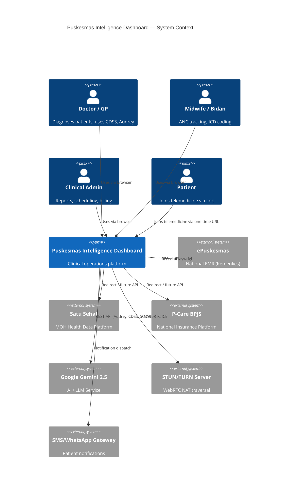
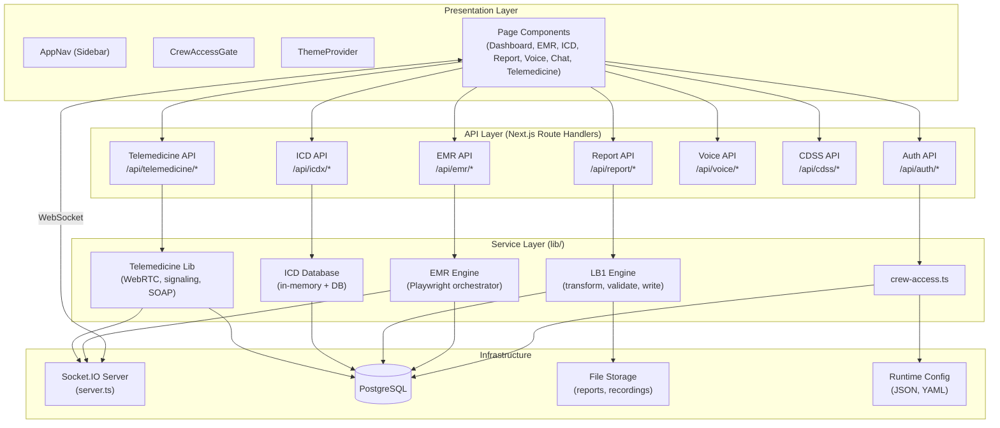
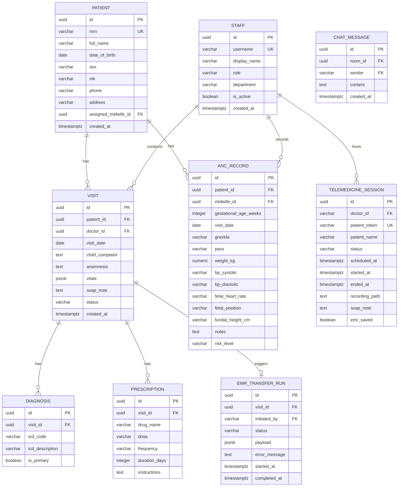
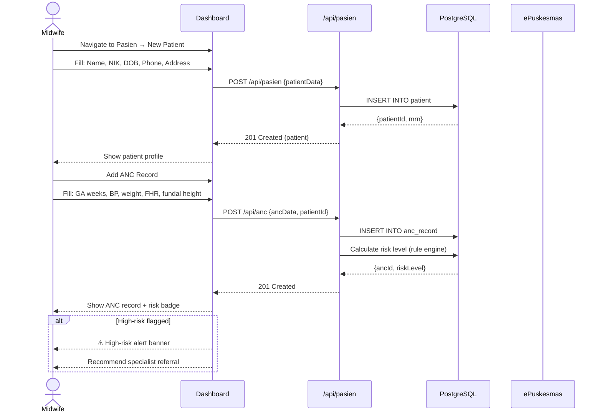
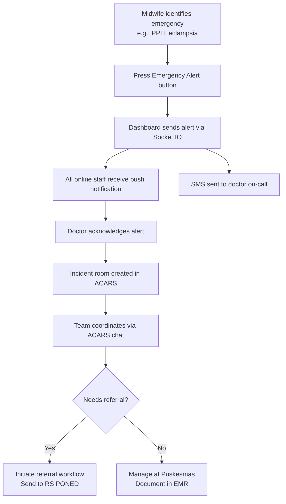

# DESIGN.md — Puskesmas Intelligence Dashboard

> Deep-dive system design, UX guidelines, and architecture rationale.
> Companion document to [README.md](./README.md).

---

## Table of Contents

- [System Architecture Diagrams](#system-architecture-diagrams)
- [Entity-Relationship Diagram](#entity-relationship-diagram)
- [Critical User Flow Diagrams](#critical-user-flow-diagrams)
- [UX & Visual Design Guidelines](#ux--visual-design-guidelines)
- [Component Design System](#component-design-system)
- [Primary Screen Wireframes](#primary-screen-wireframes)
- [Tech Stack Rationale](#tech-stack-rationale)
- [Security Architecture](#security-architecture)

---

## System Architecture Diagrams

### Full System Context Diagram



### Component Diagram



---

## Entity-Relationship Diagram



---

## Critical User Flow Diagrams

### Patient Registration & First ANC Visit



### Emergency Alert Flow (Future Feature)



---

## UX & Visual Design Guidelines

### Design Principles

1. **Clinical-first clarity** — Information hierarchy prioritizes patient safety data (alerts, vitals, risk flags) over administrative data
2. **Mobile-first, desktop-optimized** — Midwives and nurses frequently use tablets and mobile phones at the bedside
3. **Offline resilience** (future) — Core read functions should work offline with service worker caching
4. **Accessibility (WCAG 2.1 AA)** — Minimum contrast ratio 4.5:1 for body text; 3:1 for UI components; keyboard-navigable; screen-reader compatible

### Color Palette

| Role | Light Mode | Dark Mode | Usage |
|---|---|---|---|
| Primary | `#0066CC` | `#4DA3FF` | CTAs, links, active states |
| Success | `#16A34A` | `#4ADE80` | Completed transfers, normal vitals |
| Warning | `#D97706` | `#FCD34D` | Medium risk, pending actions |
| Danger | `#DC2626` | `#F87171` | High risk, errors, emergencies |
| Neutral 900 | `#111827` | `#F9FAFB` | Primary text |
| Neutral 50 | `#F9FAFB` | `#111827` | Page background |
| Surface | `#FFFFFF` | `#1F2937` | Card backgrounds |

> **Note:** These are standard Tailwind CSS color tokens. The dashboard supports both light and dark themes via `ThemeProvider.tsx` and CSS custom properties in `globals.css`.

### Typography

| Scale | Font | Size | Weight | Use |
|---|---|---|---|---|
| Display | Geist Sans | 32px | 700 | Page titles |
| Heading 1 | Geist Sans | 24px | 600 | Section headers |
| Heading 2 | Geist Sans | 18px | 600 | Card headers |
| Body | Geist Sans | 14px | 400 | Body text, table content |
| Caption | Geist Sans | 12px | 400 | Metadata, timestamps |
| Mono | Geist Mono | 13px | 400 | Code, ICD codes, MRN values |

### Spacing System

Uses 4px base grid. Key spacing tokens: `4, 8, 12, 16, 24, 32, 48, 64px`

### Design Library Recommendation

**Recommendation: Tailwind CSS + shadcn/ui**

| Library | Pros | Cons |
|---|---|---|
| **Tailwind CSS + shadcn/ui** ✅ | Utility-first, highly customizable, accessible by default, tree-shakeable | Learning curve for non-Tailwind devs |
| Material UI (MUI) | Rich component library, well-documented | Heavy bundle, opinionated styling |
| Fluent UI (Microsoft) | Accessible, enterprise-grade | React-only, Microsoft aesthetic |
| Ant Design | Large component set, good for admin UIs | Very opinionated, large bundle |

**Rationale:** `shadcn/ui` builds on Radix UI primitives (fully accessible) with Tailwind styling — giving full control without sacrificing accessibility compliance. It aligns with the existing Geist font system and the project's TypeScript-first approach.

---

## Component Design System

### Key Components

#### `<PatientCard />`
Displays a compact patient summary: MRN, name, age, risk badge, last visit date.

```tsx
<PatientCard
  mrn="PKM-2026-00123"
  name="Ny. Sari Dewi"
  age={28}
  gestationalAge="36 weeks"
  riskLevel="high"       // 'low' | 'medium' | 'high'
  lastVisit="2026-04-14"
/>
```

#### `<VitalsBadge />`
Compact vitals display with color-coded normal/abnormal indicators.

```tsx
<VitalsBadge
  bp={{ systolic: 150, diastolic: 100 }}   // 🔴 Hypertensive
  heartRate={98
