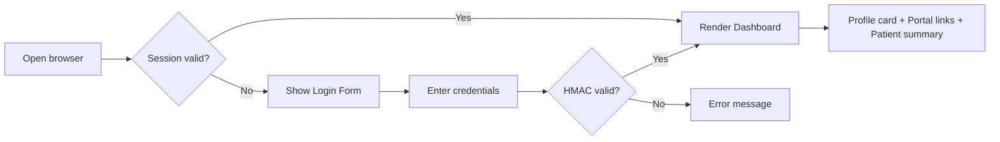
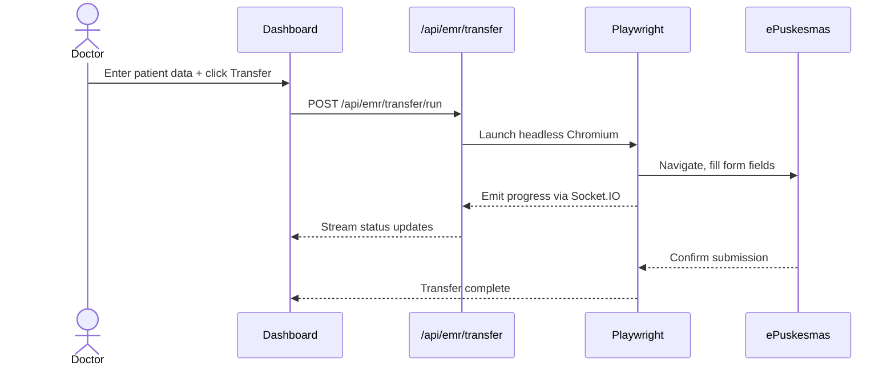
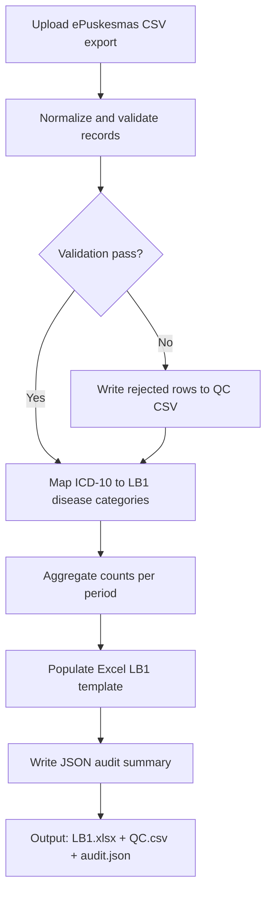
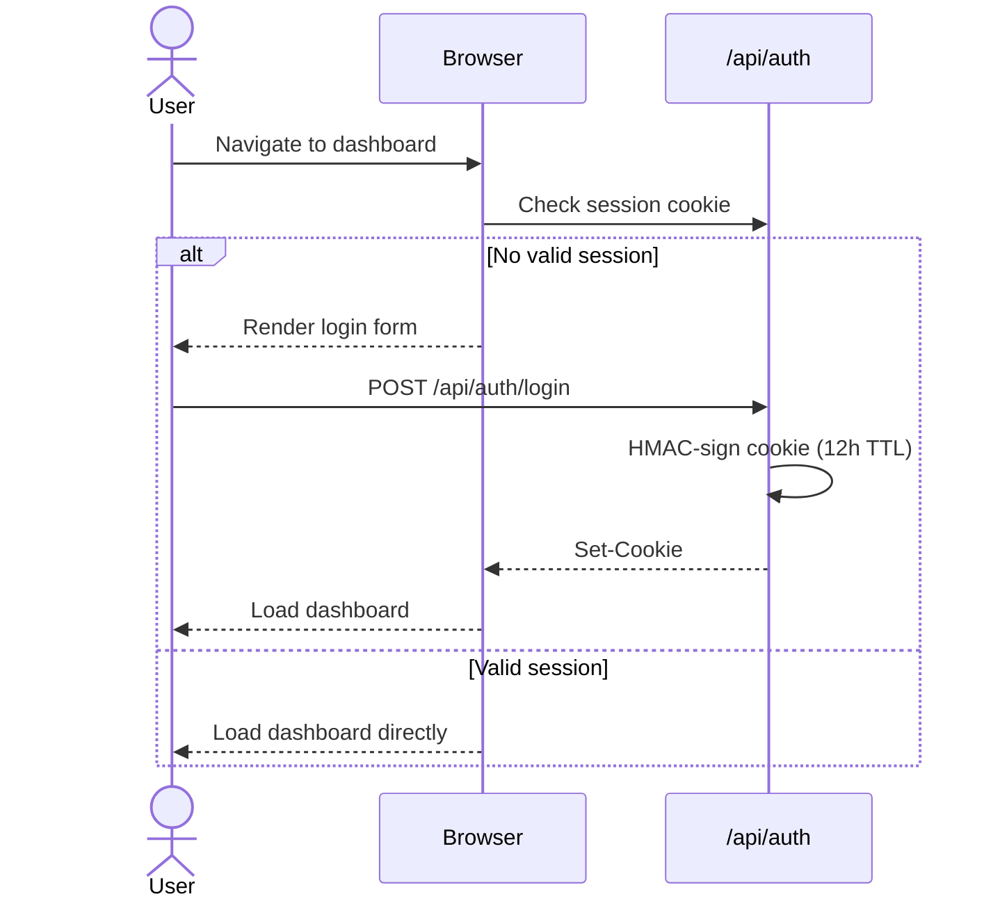
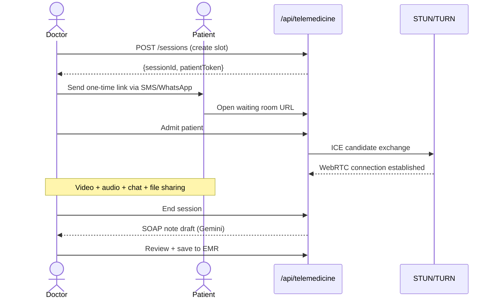
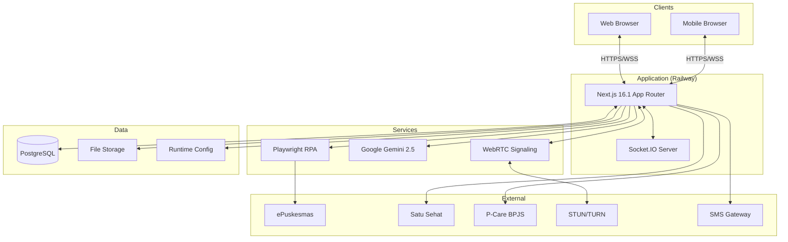
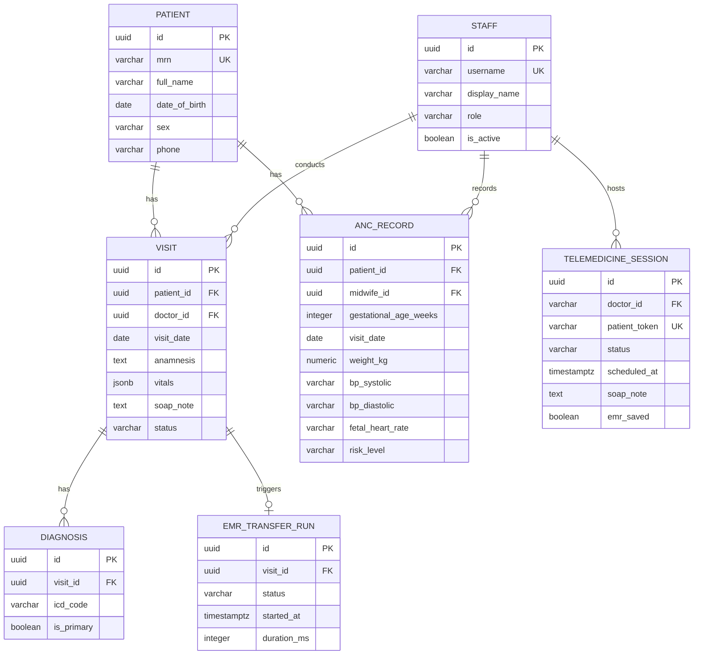
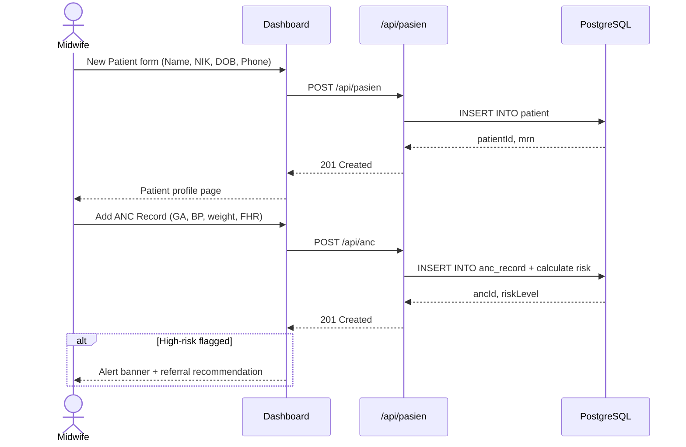
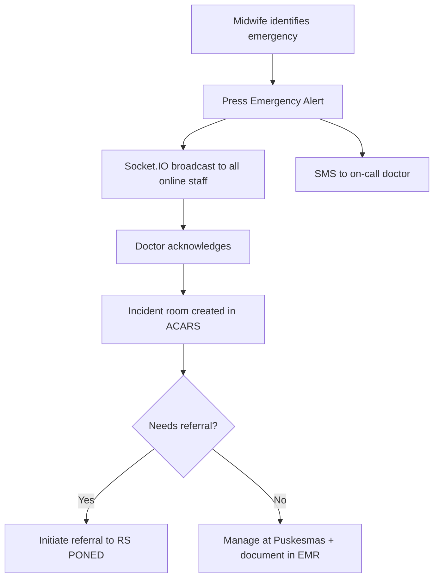

```markdown
<div align="center">

# 🏥 Puskesmas Intelligence Dashboard

**Clinical Information System for Primary & Maternal Healthcare Facilities**


[](https://github.com/DocSynapse)
[](https://nextjs.org/)
[](https://www.typescriptlang.org/)
[](https://nodejs.org/)
[](https://railway.app/)
[](./LICENSE)

_Architect & Built by [Claudesy](https://github.com/DocSynapse) · Sentra Healthcare Solutions_

> **"Technology enables, but humans decide."** — dr. Claudesy, Founder

</div>

---

## Executive Summary

**Puskesmas Intelligence Dashboard** is a full-stack clinical operations platform for **UPTD Puskesmas PONED Site, Kota Kediri**. It unifies clinical workflows, regulatory reporting, diagnostic AI, and real-time communication into one interface.

- 🩺 Reduces clinician admin burden via intelligent EMR automation and AI-assisted documentation
- 👶 Improves maternal outcomes with real-time clinical decision support and ANC tracking
- 📋 Automates monthly LB1/SP3 national reporting (hours → minutes)
- 🌐 Bridges telemedicine gap via secure WebRTC video consultations
- 🔒 Protects PHI with HMAC sessions, audit logs, and end-to-end encryption

**Target Users:**

| Persona | Role | Pain Point Solved |
|---|---|---|
| Midwife (Bidan) | ANC, delivery support | Manual ANC documentation, double-entry |
| General Practitioner | Patient encounters, diagnosis | Diagnostic uncertainty, ICD coding speed |
| Clinical Administrator | Reporting, scheduling | LB1 report preparation |
| Patient | Follow-up care | Travel distance, wait times |

---

## Table of Contents

- [Features Overview](#features-overview)
- [Quickstart](#quickstart)
- [Detailed Features](#detailed-features)
- [System Architecture](#system-architecture)
- [Project Structure](#project-structure)
- [API Reference](#api-reference)
- [Security & Privacy](#security--privacy)
- [Operations & Deployment](#operations--deployment)
- [Developer Guide](#developer-guide)
- [Assumptions & Open Questions](#assumptions--open-questions)
- [License](#license)

---

## Features Overview

| # | Feature | Status | Primary User |
|---|---|---|---|
| 1 | User Profile Dashboard | ✅ Live | All staff |
| 2 | EMR Auto-Fill Engine | ✅ Live | Doctor, Nurse |
| 3 | ICD-X Finder | ✅ Live | Doctor, Midwife |
| 4 | LB1 Report Automation | ✅ Live | Administrator |
| 5 | Audrey — Clinical AI | ✅ Live | Doctor |
| 6 | ACARS — Internal Chat | ✅ Live | All staff |
| 7 | CDSS — Decision Support | ✅ Live | Doctor, Midwife |
| 8 | Crew Access Portal | ✅ Live | All staff |
| 9 | Telemedicine | ✅ Live | Doctor, Patient |

---

## Quickstart

### Prerequisites

| Requirement | Version | Notes |
|---|---|---|
| Node.js | `>= 20.9.0` | [nodejs.org](https://nodejs.org/) |
| npm | `>= 10.x` | Bundled with Node.js |
| Chromium (Playwright) | Auto-installed | EMR Auto-Fill only |

### Installation

```bash
git clone https://github.com/DocSynapse/healthcare-dashboard.git
cd healthcare-dashboard
npm install
npx playwright install chromium
cp .env.example .env.local   # then fill in your credentials
```


### Environment Variables

```env
# Server
PORT=7000

# Authentication — generate with: openssl rand -hex 32
CREW_ACCESS_SECRET=your-secret-min-32-chars
CREW_ACCESS_USERS_JSON='[{"username":"admin","password":"change-me","displayName":"Administrator"}]'

# AI
GEMINI_API_KEY=your-gemini-api-key

# EMR / ePuskesmas RPA — NEVER commit these
EMR_BASE_URL=https://epuskesmas.example.id
EMR_LOGIN_URL=https://epuskesmas.example.id/login
EMR_USERNAME=your-username
EMR_PASSWORD=your-password
EMR_HEADLESS=true
EMR_SESSION_STORAGE_PATH=runtime/emr-session.json

# LB1 Report Engine
LB1_CONFIG_PATH=runtime/lb1-config.yaml
LB1_DATA_SOURCE_DIR=runtime/lb1-data
LB1_OUTPUT_DIR=runtime/lb1-output
LB1_HISTORY_FILE=runtime/lb1-run-history.jsonl
LB1_TEMPLATE_PATH=runtime/Laporan SP3 LB1.xlsx
LB1_MAPPING_PATH=runtime/diagnosis_mapping.csv

# Telemedicine
TURN_SERVER_URL=turn:your-turn-server:3478
TURN_SERVER_USERNAME=turn-user
TURN_SERVER_CREDENTIAL=turn-password
RECORDING_STORAGE_PATH=/var/recordings
TELEMEDICINE_PUBLIC_BASE_URL=https://your-domain.com/telemedicine/waiting
```


### Run

```bash
npm run dev       # Dev with Socket.IO (port 7000)
npm run build && npm run start   # Production
```


---

## Detailed Features

### 1. User Profile Dashboard

Home view with logged-in staff profile, one-click government portal links (Satu Sehat, SIPARWA, ePuskesmas, P-Care BPJS), and a live patient summary with vitals and ICD-X codes.

**User Stories:**

- As a doctor, I want one-click access to ePuskesmas and P-Care so I avoid navigating multiple logins
- As any staff, I want to see my role and session status so I know I'm authenticated correctly

**User Flow:**




---

### 2. EMR Auto-Fill Engine

Playwright RPA transfers structured clinical data (anamnesis, diagnosis, prescriptions) into ePuskesmas, streaming progress to the frontend via Socket.IO — eliminating double-entry.

**Sequence Diagram:**



**API Endpoints:**


| Method | Endpoint | Description | Status Codes |
| :-- | :-- | :-- | :-- |
| `POST` | `/api/emr/transfer/run` | Execute EMR auto-fill | 202, 409, 503 |
| `GET` | `/api/emr/transfer/status` | Engine status | 200 |
| `GET` | `/api/emr/transfer/history` | Run history | 200 |

**Database Schema:**

```sql
CREATE TABLE emr_transfer_runs (
  id            UUID PRIMARY KEY DEFAULT gen_random_uuid(),
  patient_mrn   VARCHAR(32) NOT NULL,
  initiated_by  VARCHAR(64) NOT NULL,
  status        VARCHAR(16) NOT NULL,   -- pending | running | success | failed
  payload       JSONB NOT NULL,
  error_message TEXT,
  started_at    TIMESTAMPTZ DEFAULT now(),
  completed_at  TIMESTAMPTZ,
  duration_ms   INTEGER
);
```

**Security:** EMR credentials are runtime-only (env vars), never logged or client-exposed. Audit log records actor + timestamp without exposing patient PHI in log lines.

---

### 3. ICD-X Finder

Multi-version ICD-10 lookup (2010, 2016, 2019) with fuzzy search, dynamic filtering, and legacy code translation.

**API:** `GET /api/icdx/lookup?q=headache&version=2019&limit=10`

```json
{
  "ok": true,
  "version": 2019,
  "results": [
    { "code": "R51", "description": "Headache", "isBillable": true },
    { "code": "G44.3", "description": "Post-traumatic headache", "isBillable": true }
  ]
}
```

**Database Schema:**

```sql
CREATE TABLE icd10_codes (
  id          SERIAL PRIMARY KEY,
  code        VARCHAR(8) NOT NULL,
  version     SMALLINT NOT NULL,        -- 2010 | 2016 | 2019
  description TEXT NOT NULL,
  category    VARCHAR(3),
  is_billable BOOLEAN DEFAULT true,
  UNIQUE(code, version)
);
CREATE INDEX idx_icd_fts ON icd10_codes
  USING gin(to_tsvector('indonesian', description));
```


---

### 4. LB1 Report Automation

End-to-end pipeline: ingest ePuskesmas export → validate → map ICD-10 to LB1 categories → populate Excel template → output `.xlsx`, QC `.csv`, and audit `.json`.

**Pipeline Flow:**



**API Endpoints:**


| Method | Endpoint | Description |
| :-- | :-- | :-- |
| `GET` | `/api/report/automation/preflight` | Pre-run validation |
| `POST` | `/api/report/automation/run` | Execute pipeline |
| `GET` | `/api/report/automation/status` | Pipeline status |
| `GET` | `/api/report/automation/history` | Run history |
| `GET` | `/api/report/files/download` | Download output file |


---

### 5. Audrey — Clinical AI Assistant

Voice-first AI copilot powered by **Google Gemini 2.5 Flash** (native audio). Provides real-time diagnostic insights calibrated for Puskesmas-level resources during patient encounters.

> ⚠️ **Clinical Disclaimer:** Audrey provides AI-assisted suggestions only. All clinical decisions must be made by a licensed healthcare professional.

**API:** `POST /api/voice/chat`

```json
// Request
{
  "message": "Patient G2P1 36wks, BP 150/100, headache. Thoughts?",
  "context": "ANC",
  "sessionId": "session-abc123"
}

// Response
{
  "ok": true,
  "reply": "Consider pre-eclampsia. Check proteinuria, assess for severe features (visual changes, epigastric pain). Per PONED protocol: MgSO4 loading dose if confirmed; prepare urgent referral.",
  "confidence": "high"
}
```


---

### 6. ACARS — Internal Chat

Socket.IO-backed team messaging with room-based conversations, typing indicators, and online presence tracking.

**Real-Time Socket.IO Events:**


| Event | Direction | Payload |
| :-- | :-- | :-- |
| `acars:message` | Server → Client | `{roomId, sender, text, timestamp}` |
| `acars:typing` | Client → Server | `{roomId, username}` |
| `acars:presence` | Server → Client | `{username, status}` |


---

### 7. CDSS — Clinical Decision Support

Combines a local knowledge base (159 diseases, 45,030 encounter records) with Gemini reasoning to deliver ranked differential diagnoses, treatment plans, and referral criteria.

**API:** `POST /api/cdss/diagnose`

```json
// Request
{
  "symptoms": ["headache", "fever", "neck stiffness"],
  "patientAge": 25,
  "patientSex": "female",
  "vitals": { "temp": 38.5, "bp": "120/80" }
}

// Response
{
  "ok": true,
  "differentials": [
    {
      "rank": 1,
      "diagnosis": "Bacterial Meningitis",
      "icdCode": "G00.9",
      "urgency": "emergency",
      "referralRequired": true,
      "immediateActions": ["Urgent hospital referral", "Do not delay for LP"]
    }
  ],
  "disclaimer": "AI-generated. Clinical judgment required."
}
```


---

### 8. Crew Access Portal

Authentication gate using HMAC-SHA256 signed session cookies. Credentials resolved in priority order: `env vars > runtime JSON > compiled defaults`.

**Auth Flow:**



**Security Properties:**


| Property | Value |
| :-- | :-- |
| Cookie flags | `HttpOnly`, `Secure`, `SameSite=Strict` |
| HMAC algorithm | SHA-256 |
| Session TTL | 12 hours |
| Rate limiting | 5 login attempts / 15 min (recommended) |


---

### 9. Telemedicine — Virtual Consultation

Real-time video consultations via **WebRTC** peer-to-peer with Socket.IO signaling, STUN/TURN fallback, in-call chat, file sharing, consent-gated recording, and AI-generated post-session SOAP notes.

**Consultation Workflow:**



**API Endpoints:**


| Method | Endpoint | Description |
| :-- | :-- | :-- |
| `POST` | `/api/telemedicine/sessions` | Create session |
| `GET` | `/api/telemedicine/sessions` | List sessions |
| `PATCH` | `/api/telemedicine/sessions/:id` | Update status |
| `POST` | `/api/telemedicine/signal` | WebRTC signaling |
| `POST` | `/api/telemedicine/recording/start` | Start recording |
| `POST` | `/api/telemedicine/recording/stop` | Stop \& save |
| `GET/POST` | `/api/telemedicine/schedule` | Slot management |

**Database Schema:**

```sql
CREATE TABLE telemedicine_sessions (
  id              UUID PRIMARY KEY DEFAULT gen_random_uuid(),
  doctor_id       VARCHAR(64) NOT NULL,
  patient_token   VARCHAR(128) UNIQUE NOT NULL,
  patient_name    VARCHAR(128),
  status          VARCHAR(16) DEFAULT 'scheduled',
  scheduled_at    TIMESTAMPTZ,
  started_at      TIMESTAMPTZ,
  ended_at        TIMESTAMPTZ,
  recording_path  TEXT,
  soap_note       TEXT,
  emr_saved       BOOLEAN DEFAULT false,
  created_at      TIMESTAMPTZ DEFAULT now()
);
```

> ⚠️ Recordings contain PHI. Store encrypted (AES-256) at rest. Restrict access to authorized clinical staff only.

---

## System Architecture

### Architecture Diagram




### Deployment Recommendation

**Recommended: Enhanced Monolith (current) → Modular Monolith (v2)**


| Approach | Verdict | Reason |
| :-- | :-- | :-- |
| Monolith | ✅ Now | Simple ops, fits current team and scale |
| Microservices | ❌ Premature | Operational overhead not justified |
| Serverless | ❌ Incompatible | Socket.IO and WebRTC require persistent connections |

At >50 concurrent users, extract Playwright RPA and CDSS inference to separate background worker processes.

### Scaling Strategy

- **Stateless API routes** → horizontally scalable (HMAC cookies, no server-side session store)
- **Socket.IO + Redis Adapter** → multi-instance real-time when scaling beyond one process
- **Playwright worker pool** → max 3 concurrent RPA jobs to prevent resource exhaustion
- **ICD-10 cache** → Redis with 24h TTL reduces DB read pressure

---

## Project Structure

```
healthcare-dashboard/
├── server.ts                  # Custom HTTP + Socket.IO server entry
├── next.config.ts
├── tsconfig.json              # TypeScript strict mode
├── railway.toml
├── package.json
│
├── src/
│   ├── app/
│   │   ├── layout.tsx         # Root layout (ThemeProvider + CrewAccessGate + AppNav)
│   │   ├── page.tsx           # Home / Profile Dashboard
│   │   ├── globals.css        # Dark/light theme tokens
│   │   ├── emr/               # EMR Auto-Fill UI
│   │   ├── icdx/              # ICD-X lookup UI
│   │   ├── report/            # LB1 report UI
│   │   ├── voice/             # Audrey voice UI
│   │   ├── acars/             # Internal chat UI
│   │   ├── pasien/            # Patient records UI
│   │   ├── telemedicine/      # Telemedicine UI
│   │   └── api/               # All route handlers
│   │
│   ├── components/
│   │   ├── AppNav.tsx
│   │   ├── CrewAccessGate.tsx
│   │   ├── ThemeProvider.tsx
│   │   └── ui/
│   │
│   └── lib/
│       ├── crew-access.ts
│       ├── server/
│       ├── lb1/               # LB1 pipeline engine
│       ├── emr/               # EMR RPA engine
│       ├── icd/               # ICD-10 database
│       └── telemedicine/      # WebRTC, signaling, SOAP generator
│
├── docs/plans/
├── runtime/                   # Gitignored — secrets & configs
└── mintlify-docs/             # Public API docs
```


---

## API Reference

All routes prefixed `/api`. Authentication via HMAC-signed session cookie required on all routes.

### Full Endpoint Table

| Method | Endpoint | Module | Description |
| :-- | :-- | :-- | :-- |
| `POST` | `/api/auth/login` | Auth | Authenticate staff |
| `POST` | `/api/auth/logout` | Auth | End session |
| `GET` | `/api/auth/session` | Auth | Validate session |
| `POST` | `/api/emr/transfer/run` | EMR | Run auto-fill |
| `GET` | `/api/emr/transfer/status` | EMR | Engine status |
| `GET` | `/api/emr/transfer/history` | EMR | Run history |
| `GET` | `/api/icdx/lookup` | ICD-X | Code search |
| `GET` | `/api/report/automation/preflight` | LB1 | Pre-run check |
| `POST` | `/api/report/automation/run` | LB1 | Execute pipeline |
| `GET` | `/api/report/automation/status` | LB1 | Status |
| `GET` | `/api/report/automation/history` | LB1 | History |
| `GET` | `/api/report/files/download` | LB1 | Download output |
| `GET/POST/DELETE` | `/api/report/clinical` | Clinical | CRUD reports |
| `POST` | `/api/cdss/diagnose` | CDSS | Differential Dx |
| `POST` | `/api/voice/chat` | Voice | Chat with Audrey |
| `POST` | `/api/voice/tts` | Voice | Text-to-speech |
| `GET` | `/api/voice/token` | Voice | Session token |
| `POST` | `/api/telemedicine/sessions` | Tele | Create session |
| `GET` | `/api/telemedicine/sessions` | Tele | List sessions |
| `PATCH` | `/api/telemedicine/sessions/:id` | Tele | Update session |
| `POST` | `/api/telemedicine/signal` | Tele | WebRTC signaling |
| `POST` | `/api/telemedicine/recording/start` | Tele | Start recording |
| `POST` | `/api/telemedicine/recording/stop` | Tele | Stop recording |
| `GET/POST` | `/api/telemedicine/schedule` | Tele | Slot management |


---

## Security \& Privacy

### Authentication \& Authorization

| Property | Implementation |
| :-- | :-- |
| Mechanism | HMAC-SHA256 signed session cookies |
| TTL | 12 hours |
| Cookie flags | `HttpOnly`, `Secure`, `SameSite=Strict` |
| Role enforcement | API route-level (`doctor`, `midwife`, `nurse`, `admin`) |
| Future upgrade | OAuth2/OIDC via Keycloak or Auth0 |

### Encryption \& Secrets

| Layer | Mechanism |
| :-- | :-- |
| In transit | TLS 1.3 (Railway/CDN enforced) |
| At rest (recordings) | AES-256 |
| Secrets | Railway environment vault |
| Cookie | HMAC-SHA256 signature |

### Compliance Notes

- **Indonesia:** Align with UU No. 17/2023 (Kesehatan) and applicable Permenkes
- **GDPR equivalence:** Data minimization, purpose limitation, right-to-erasure
- **Consent:** Explicit patient consent required for telemedicine recording and data sharing
- **Audit logging:** `{timestamp, actor, action, resource_type, resource_id}` — no patient name/MRN in log lines


### Threat Mitigations

| Threat | Mitigation |
| :-- | :-- |
| Session forgery | HMAC-signed cookies, server-side validation |
| Brute force login | Rate limit: 5 req / 15 min on `/api/auth/login` |
| XSS | Next.js CSP headers, no `dangerouslySetInnerHTML` |
| SQL injection | Parameterized queries via ORM |
| SSRF (Playwright) | URL allowlist for RPA targets |
| PHI leak | No identifiers in logs; PHI encrypted at rest |


---

## Operations \& Deployment

### Railway Deployment

```toml
# railway.toml
[build]
builder = "nixpacks"
buildCommand = "npm run build"

[deploy]
startCommand = "npm run start"
restartPolicyType = "on_failure"
restartPolicyMaxRetries = 3
```

**Steps:** Push to GitHub → Connect to Railway → Set all env vars → Auto-deploys on `master` push.

### CI/CD (Recommended)

```yaml
# .github/workflows/ci.yml
name: CI
on: [push, pull_request]
jobs:
  build:
    runs-on: ubuntu-latest
    steps:
      - uses: actions/checkout@v4
      - uses: actions/setup-node@v4
        with: { node-version: '20' }
      - run: npm ci
      - run: npm run build
```


### Observability

| Signal | Tool | Key Alert Thresholds |
| :-- | :-- | :-- |
| Logs | Railway structured logs | Error rate > 5% / 5 min |
| Metrics | Railway metrics | Memory > 85% sustained 10 min |
| Tracing (recommended) | OpenTelemetry + Jaeger | Response time > 2s avg |

### Backup \& Recovery

| Data | Frequency | Recovery |
| :-- | :-- | :-- |
| PostgreSQL | Daily `pg_dump` to S3 | Restore from latest dump |
| LB1 output files | Retained 12 months | Download from file storage |
| Telemedicine recordings | Per institutional policy | Restore from encrypted S3 |


---

## Developer Guide

### Local Setup

```bash
git clone https://github.com/DocSynapse/healthcare-dashboard.git
cd healthcare-dashboard
npm install && npx playwright install chromium
cp .env.example .env.local
npm run dev
```


### Database Seeds

```bash
npm run db:seed:icd       # Seed ICD-10 all versions
npm run db:seed:patients  # Anonymized dummy patients
npm run db:reset          # Full reset
```


### Commit Convention

```
type(scope): short imperative description

Types: feat | fix | chore | docs | refactor | test | perf
```


### PR Checklist

- [ ] `npm run build` passes with zero TypeScript errors
- [ ] No secrets in diff
- [ ] New features have test cases
- [ ] API changes updated in endpoint table
- [ ] `.env.example` updated for new variables
- [ ] `CHANGELOG.md` updated


### Available Scripts

| Script | Description |
| :-- | :-- |
| `npm run dev` | Dev server with Socket.IO (port 7000) |
| `npm run dev:next` | Next.js only (no Socket.IO) |
| `npm run build` | Production bundle |
| `npm run start` | Production server |
| `npm run docs:dev` | Mintlify preview (port 3004) |
| `npm run docs:api` | Regenerate OpenAPI spec |


---

## Assumptions \& Open Questions

| \# | Assumption | Impact if Wrong |
| :-- | :-- | :-- |
| A1 | ANC protocols follow Kemenkes RI 2020 guidelines | Audrey/CDSS responses need recalibration |
| A2 | ePuskesmas has no public REST API | If API exists, replace RPA with direct calls |
| A3 | Concurrent users < 50; monolith is sufficient | Redesign needed above this threshold |
| A4 | PostgreSQL is intended primary DB | Schema must be confirmed |
| A5 | TURN server provisioned separately | WebRTC fails in restricted networks without it |

**Open Questions (up to 5):**

1. Which specific Kemenkes ANC checklist should Audrey and CDSS follow per trimester?
2. Is PostgreSQL live in production, or still file-backed? Migration timeline?
3. Multi-facility expansion to other Puskesmas in Kota Kediri — planned?
4. SMS/WhatsApp gateway preference (Twilio, WATI, local provider)?
5. Has Dinas Kesehatan Kota Kediri reviewed the system? Any data localization requirements?

---

## Related Documentation

| Document | Description |
| :-- | :-- |
| [ARCHITECTURE.md](./ARCHITECTURE.md) | Full architecture breakdown |
| [CONTRIBUTING.md](./CONTRIBUTING.md) | Dev workflow and conventions |
| [CHANGELOG.md](./CHANGELOG.md) | Version history |
| [SECURITY.md](./SECURITY.md) | Vulnerability reporting policy |
| [DISCLAIMER.md](./DISCLAIMER.md) | Clinical and liability disclaimer |
| [DATA_PRIVACY.md](./DATA_PRIVACY.md) | Privacy commitments |
| [MODEL_CARD.md](./MODEL_CARD.md) | AI model summary |
| [docs/DEPLOYMENT.md](./docs/DEPLOYMENT.md) | Deployment operations |
| [mintlify-docs/](./mintlify-docs/) | Public API documentation |


---

## License

**MIT License** — See [`LICENSE`](./LICENSE).

Clinical use is subject to institutional policy, Indonesian law, and disclaimers in [`DISCLAIMER.md`](./DISCLAIMER.md).

> Copyright © 2026 **Sentra Artificial Intelligence** — dr. Claudesy

---

<div align="center">

Built with care for frontline healthcare workers in Indonesia. 🇮🇩

_Architect & Built by [Claudesy](https://github.com/DocSynapse) · Sentra Healthcare Solutions_

</div>
```

***

# `DESIGN.md` — System & UI Design Reference

```markdown
# DESIGN.md — Puskesmas Intelligence Dashboard

> Deep-dive system design, UX guidelines, and architecture rationale.
> Companion to [README.md](./README.md).

---

## Table of Contents

- [ER Diagram](#er-diagram)
- [Critical Flow Diagrams](#critical-flow-diagrams)
- [UX & Visual Design Guidelines](#ux--visual-design-guidelines)
- [Component Design System](#component-design-system)
- [Primary Screen Wireframes](#primary-screen-wireframes)
- [Tech Stack Rationale](#tech-stack-rationale)

---

## ER Diagram




---

## Critical Flow Diagrams

### Patient Registration \& First ANC Visit




### Emergency Alert Flow




---

## UX \& Visual Design Guidelines

### Design Principles

1. **Clinical-first hierarchy** — Patient safety data (alerts, vitals, risk flags) always visually dominant
2. **Mobile-first** — Midwives frequently use tablets at the bedside; all layouts work at 320px+
3. **Accessibility (WCAG 2.1 AA)** — Minimum contrast 4.5:1 body text, 3:1 UI components, keyboard-navigable
4. **Offline resilience (future)** — Core reads via service worker caching

### Color Palette

| Role | Light Mode | Dark Mode | Usage |
| :-- | :-- | :-- | :-- |
| Primary | `#0066CC` | `#4DA3FF` | CTAs, links, active states |
| Success | `#16A34A` | `#4ADE80` | Normal vitals, completed transfers |
| Warning | `#D97706` | `#FCD34D` | Medium risk, pending actions |
| Danger | `#DC2626` | `#F87171` | High risk, errors, emergencies |
| Text primary | `#111827` | `#F9FAFB` | Body text |
| Surface | `#FFFFFF` | `#1F2937` | Card backgrounds |

### Typography

| Scale | Font | Size | Weight | Use |
| :-- | :-- | :-- | :-- | :-- |
| Display | Geist Sans | 32px | 700 | Page titles |
| Heading 1 | Geist Sans | 24px | 600 | Section headers |
| Heading 2 | Geist Sans | 18px | 600 | Card headers |
| Body | Geist Sans | 14px | 400 | Content, table text |
| Mono | Geist Mono | 13px | 400 | ICD codes, MRNs |

### Design Library: Tailwind CSS + shadcn/ui ✅

| Option | Verdict | Reason |
| :-- | :-- | :-- |
| Tailwind + shadcn/ui | ✅ Recommended | Radix primitives (accessible), fully customizable, TypeScript-native |
| Material UI | Neutral | Rich but heavy, opinionated |
| Ant Design | Not recommended | Large bundle, enterprise-heavy aesthetic |


---

## Component Design System

### Key Components

#### `<PatientCard />`

Compact patient summary: MRN badge, name, age, gestational age, risk level chip, last visit.

```tsx
<PatientCard
  mrn="PKM-2026-00123"
  name="Ny. Sari Dewi"
  age={28}
  gestationalAge="36 weeks"
  riskLevel="high"    // 'low' | 'medium' | 'high'
  lastVisit="2026-04-14"
/>
```

Risk level maps to color: `low` → green, `medium` → amber, `high` → red.

#### `<VitalsBadge />`

Color-coded vitals display with threshold-based status indicators.

```tsx
<VitalsBadge
  bp={{ systolic: 150, diastolic: 100 }}  // red — hypertensive
  heartRate={98}                           // green — normal
  temp={37.2}                              // green — normal
/>
```


#### `<TransferStatus />`

Real-time Socket.IO-driven progress bar for EMR transfers. Three states: `idle`, `running` (animated progress), `complete`/`failed` (toast notification).

---

## Primary Screen Wireframes

### Dashboard (Home)

```
┌─────────────────────────────────────────────────────────┐
│  [Logo] Puskesmas Intelligence    [User] dr. Ferdi  [⚙]  │
├──────────┬──────────────────────────────────────────────┤
│  SIDEBAR │  PROFILE CARD                                │
│          │  ┌──────────────────────────────────────┐    │
│ Dashboard│  │ 👤 dr. Claudesy  [Doctor]       │    │
│ EMR      │  │ Dept: Umum  |  Last login: 07:00     │    │
│ ICD-X    │  └──────────────────────────────────────┘    │
│ Reports  │                                              │
│ Audrey   │  PORTAL QUICK-LINKS                          │
│ ACARS    │  [Satu Sehat] [SIPARWA] [ePuskesmas] [BPJS]  │
│ CDSS     │                                              │
│ Pasien   │  TODAY'S PATIENTS                            │
│ Teleconsult  ┌─────────────────────────────────────┐    │
│          │  │ MRN       Name         Risk  Last Dx │    │
│          │  │ PKM-001   Ny. Sari D.  🔴   Z34.2   │    │
│          │  │ PKM-002   Tn. Budi W.  🟢   R51     │    │
│          │  └─────────────────────────────────────┘    │
└──────────┴──────────────────────────────────────────────┘
```


### ANC Record Form

```
┌─────────────────────────────────────────────────────────┐
│  Patient: Ny. Sari Dewi  |  MRN: PKM-2026-00123         │
│  ─────────────────────────────────────────────────────  │
│  Gestational Age (weeks): [____]  Visit Date: [date]    │
│                                                         │
│  Blood Pressure: Systolic [___] / Diastolic [___] mmHg  │
│  Weight: [___] kg    Fundal Height: [___] cm            │
│  Fetal Heart Rate: [___] bpm    Position: [dropdown]    │
│                                                         │
│  Notes: [textarea]                                      │
│                                                         │
│  Risk Assessment: ● Auto-calculated ▼                   │
│                                                         │
│                      [Cancel]  [Save ANC Record →]      │
└─────────────────────────────────────────────────────────┘
```


### Telemedicine Waiting Room (Patient View)

```
┌─────────────────────────────────────────────────────────┐
│                                                         │
│            🏥 Puskesmas PONED Site                 │
│                                                         │
│         Your doctor will admit you shortly.             │
│                                                         │
│              ⏱  Estimated wait: ~5 minutes              │
│                                                         │
│         📹  Camera: ● ON    🎤  Microphone: ● ON        │
│                                                         │
│         ┌─────────────────────────────────┐             │
│         │  [Your camera preview here]     │             │
│         └─────────────────────────────────┘             │
│                                                         │
│              [Turn off camera]  [Mute mic]              │
│                                                         │
└─────────────────────────────────────────────────────────┘
```


---

## Tech Stack Rationale

| Layer | Choice | Rationale |
| :-- | :-- | :-- |
| Framework | Next.js 16 (App Router) | File-based routing, server components, built-in API routes |
| Language | TypeScript strict | Type safety critical in health data systems |
| Real-time | Socket.IO | Mature, reliable, room-scoped events; works with custom Node server |
| AI | Google Gemini 2.5 Flash | Native audio support (required for Audrey), fast inference |
| RPA | Playwright | Only viable integration path for ePuskesmas (no public API) |
| Spreadsheet | SheetJS | Battle-tested Excel I/O for LB1 template population |
| DB | PostgreSQL | ACID compliance critical for clinical records |
| Deployment | Railway | Zero-config, Git-native, supports custom HTTP server |
| UI | Tailwind + shadcn/ui | Accessible primitives, TypeScript-first, dark mode native |


---

> **Image assets to export (SVG/PNG):**
> - `docs/assets/architecture-diagram.svg` — System context diagram
> - `docs/assets/er-diagram.svg` — Entity-relationship diagram
> - `docs/assets/dashboard-wireframe.png` — Dashboard screen mockup
> - `docs/assets/anc-form-wireframe.png` — ANC record form mockup
> - `docs/assets/telemedicine-wireframe.png` — Waiting room mockup

```
