<div align="center">

# IntelligenceBoard

**Indonesia Calibrated Clinical Intelligence Platform**

</div>
---

## Overview

<table>
  <tr>
    <td width="30%" align="center" valign="middle">
      
      <br/><br/>
      <strong>INTELLIGENCEBOARD</strong>
    </td>
    <td width="70%" valign="top">
      <p><strong>IntelligenceBoard</strong> is a full-stack clinical operations platform that unifies clinical workflows, regulatory reporting, diagnostic Artificial Intelligence, and real-time communication into a single decision surface — engineered to think with the clinician, not behind them.</p>
      <p>Unlike generic Electronic Medical Records, this platform is calibrated against the <strong>local epidemiological signatures of Indonesian primary healthcare</strong>: dengue seasonality patterns tied to regional geography and rainfall cycles, recurrent ISPA waves across musim pancaroba, hypertension prevalence in productive-age cohorts, maternal-risk patterns specific to PONED case mix, and tuberculosis clusters mapped to population-density kelurahan. Every alert, prediction, and triage suggestion is weighted by <strong>what actually happens in the Indonesian catchment context</strong> — not by foreign baseline assumptions.</p>
      <p>The system continuously learns from incoming kunjungan data, surfaces early-outbreak signals before they appear in weekly SKDR reports, and gives kepala puskesmas, dokter umum, bidan, and perawat a shared, real-time operational picture — auditable, FHIR-native, and aligned with Kementerian Kesehatan reporting standards.</p>
    </td>
  </tr>
</table>

<div align="center">


[](https://github.com/Claudesy)
[](https://nextjs.org/)
[](https://www.typescriptlang.org/)
[](https://nodejs.org/)
[](https://hl7.org/fhir/)
[](./LICENSE)

_Architect & Built by [Claudesy](https://github.com/Claudesy)_

> **"Technology enables, but humans decide."** — dr. Claudesy, Founder

</div>

---

## Why a Locally-Calibrated Intelligence Layer

A generic clinical dashboard treats every patient as a global baseline. A **locally-calibrated intelligence dashboard** treats every patient as a member of a specific population with specific risks. For Indonesian primary healthcare facilities, this distinction is operationally decisive.

| Dimension | Generic EMR | IntelligenceBoard |
|---|---|---|
| **Disease prior probabilities** | Static, foreign textbook values | Bayesian priors recomputed from rolling 90-day local kunjungan data |
| **Outbreak detection** | Manual, weekly SKDR submission | Real-time anomaly detection on syndromic clusters (panas + nyeri sendi → DBD watch) |
| **Triage scoring** | Generic ESI/MTS | ESI re-weighted by local maternal, neonatal, and infectious-disease prevalence |
| **Geographic awareness** | None | Heatmap per kelurahan, RT/RW-level case clustering |
| **Seasonal awareness** | None | Embedded musim hujan / kemarau / pancaroba models for ISPA, DBD, diare |
| **Reporting** | Manual SP2TP / SIMPUS export | Auto-generated, audit-trailed, ready for Dinkes reporting |

---

## Executive Summary

**IntelligenceBoard** is a full-stack clinical operations platform for Indonesian primary healthcare facilities (Puskesmas, FKTP, PONED). It unifies clinical workflows, regulatory reporting, diagnostic Artificial Intelligence, and real-time communication into one interface.

- Reduces clinician admin burden via intelligent EMR automation and Artificial Intelligence-assisted documentation
- Improves maternal outcomes with real-time clinical decision support and ANC tracking
- Automates monthly LB1/SP3 national reporting (hours → minutes)
- Bridges telemedicine gap via secure WebRTC video consultations
- Protects PHI with HMAC sessions, audit logs, and end-to-end encryption
- Calibrated against Indonesian epidemiological patterns: DBD, ISPA, TB, maternal risk, hypertension

**Target Users:**

| Persona | Role | Pain Point Solved |
|---|---|---|
| Midwife (Bidan) | ANC, delivery support | Manual ANC documentation, double-entry |
| General Practitioner | Patient encounters, diagnosis | Diagnostic uncertainty, ICD coding speed |
| Clinical Administrator | Reporting, scheduling | LB1 report preparation |
| Patient | Follow-up care | Travel distance, wait times |

---

## Table of Contents

- [Features Overview](#features-overview)
- [Quickstart](#quickstart)
- [Detailed Features](#detailed-features)
- [System Architecture](#system-architecture)
- [Project Structure](#project-structure)
- [API Reference](#api-reference)
- [Security & Privacy](#security--privacy)
- [Operations & Deployment](#operations--deployment)
- [Developer Guide](#developer-guide)
- [Assumptions & Open Questions](#assumptions--open-questions)
- [License](#license)

---

## Features Overview

### Clinical Intelligence

| # | Feature | Status | Primary User |
|---|---------|--------|--------------|
| 1 | CDSS — Clinical Decision Support System | ✅ Live | Doctor, Midwife |
| 2 | Vital Signs Monitoring & Instant Red Alerts | ✅ Live | Doctor, Nurse |
| 3 | Clinical Trajectory Analysis | ✅ Live | Doctor |
| 4 | Momentum & Deterioration Scoring Engine | ✅ Live | Doctor |
| 5 | Time-to-Critical Prediction | ✅ Live | Doctor |
| 6 | Convergence Pattern Detection | ✅ Live | Doctor, Nurse |
| 7 | NEWS2 Early Warning Score | ✅ Live | Doctor, Nurse |
| 8 | Disease Classifiers (Glucose, Hypertension, Occult Shock) | ✅ Live | Doctor |
| 9 | Critical Mind — Clinical Reasoning Interface | ✅ Live | Doctor |
| 10 | Medical Calculators (BMI, MAP, eGFR, qSOFA, GCS, + 13 more) | ✅ Live | Doctor, Midwife |

### Patient Care

| # | Feature | Status | Primary User |
|---|---------|--------|--------------|
| 11 | EMR Auto-Fill Engine (ePuskesmas RPA via Playwright) | ✅ Live | Doctor, Nurse |
| 12 | ICD-X Finder & Diagnosis Coding | ✅ Live | Doctor, Midwife |
| 13 | Telemedicine — LiveKit Video + Consultation | ✅ Live | Doctor, Patient |
| 14 | Consultation Request & EMR Transfer Flow | ✅ Live | Doctor, Nurse |
| 15 | Clinical Report Generator (PDF) | ✅ Live | Doctor, Administrator |
| 16 | LB1 Report Automation | ✅ Live | Administrator |

### Artificial Intelligence & Voice

| # | Feature | Status | Primary User |
|---|---------|--------|--------------|
| 17 | Audrey — Voice Clinical Artificial Intelligence | ✅ Live | Doctor |
| 18 | Speech-to-Text / Text-to-Speech Engine | ✅ Live | Doctor |
| 19 | AI Insights & Clinical Narrative Generator | ✅ Live | Doctor |
| 20 | Anamnesis Extractor (NLP → structured EMR fields) | ✅ Live | Doctor |

### Operations & Administration

| # | Feature | Status | Primary User |
|---|---------|--------|--------------|
| 21 | User Profile Dashboard | ✅ Live | All staff |
| 22 | Hub — Crew Directory & Profiles | ✅ Live | All staff |
| 23 | ACARS — Internal Communication | ✅ Live | All staff |
| 24 | Admin Console (Users, Institutions, Registrations) | ✅ Live | Administrator |
| 25 | NOTAM — Operational Notices System | ✅ Live | Administrator, Doctor |
| 26 | Staff Geographic Map | ✅ Live | Administrator |
| 27 | Online Status Tracker | ✅ Live | All staff |

### Security & Compliance

| # | Feature | Status | Primary User |
|---|---------|--------|--------------|
| 28 | Crew Access Portal (scrypt auth, HMAC sessions, 12h TTL) | ✅ Live | All staff |
| 29 | Security Audit Log (PHI-safe, SHA-256 hashed user IDs) | ✅ Live | Administrator |
| 30 | Screening Audit Logbook (immutable hash chain) | ✅ Live | Administrator |
| 31 | Role-Based Access Control (RBAC) | ✅ Live | Administrator |

### Real-time & Observability

| # | Feature | Status | Primary User |
|---|---------|--------|--------------|
| 32 | Intelligence Dashboard (Socket.io live feeds) | ✅ Live | Doctor, Administrator |
| 33 | Multi-Bridge Real-time (EMR · Telemedicine · NOTAM) | ✅ Live | System |
| 34 | Langfuse Artificial Intelligence Observability | ✅ Live | System |
| 35 | Sentry Error Tracking (PHI-scrubbed before send) | ✅ Live | System |
| 36 | Health Check API (`/api/health`) | ✅ Live | System |

---

## Quickstart

### Prerequisites

| Requirement | Version | Notes |
|---|---|---|
| Node.js | `>= 20.9.0` | [nodejs.org](https://nodejs.org/) |
| npm | `>= 10.x` | Bundled with Node.js |
| Chromium (Playwright) | Auto-installed | EMR Auto-Fill only |

### Installation

```bash
git clone https://github.com/Claudesy/intelligenceBoard.git
cd intelligenceBoard
npm install
npx playwright install chromium
cp .env.example .env.local   # then fill in your credentials
```

### Environment Variables

```env
# Server
PORT=7000

# Authentication — generate with: openssl rand -hex 32
CREW_ACCESS_SECRET=your-secret-min-32-chars
CREW_ACCESS_USERS_JSON='[{"username":"admin","password":"change-me","displayName":"Administrator"}]'

# AI
GEMINI_API_KEY=your-gemini-api-key

# EMR / ePuskesmas RPA — NEVER commit these
EMR_BASE_URL=https://epuskesmas.example.id
EMR_LOGIN_URL=https://epuskesmas.example.id/login
EMR_USERNAME=your-username
EMR_PASSWORD=your-password
EMR_HEADLESS=true
EMR_SESSION_STORAGE_PATH=runtime/emr-session.json

# LB1 Report Engine
LB1_CONFIG_PATH=runtime/lb1-config.yaml
LB1_DATA_SOURCE_DIR=runtime/lb1-data
LB1_OUTPUT_DIR=runtime/lb1-output
LB1_HISTORY_FILE=runtime/lb1-run-history.jsonl
LB1_TEMPLATE_PATH=runtime/Laporan SP3 LB1.xlsx
LB1_MAPPING_PATH=runtime/diagnosis_mapping.csv

# Telemedicine
TURN_SERVER_URL=turn:your-turn-server:3478
TURN_SERVER_USERNAME=turn-user
TURN_SERVER_CREDENTIAL=turn-password
RECORDING_STORAGE_PATH=/var/recordings
TELEMEDICINE_PUBLIC_BASE_URL=https://your-domain.com/telemedicine/waiting
```

### Run

```bash
npm run dev       # Dev with Socket.IO (port 7000)
npm run build && npm run start   # Production
```

---

## Detailed Features

### 1. User Profile Dashboard

Home view with logged-in staff profile, one-click government portal links (Satu Sehat, SIPARWA, ePuskesmas, P-Care BPJS), and a live patient summary with vitals and ICD-X codes.

**User Stories:**
- As a doctor, I want one-click access to ePuskesmas and P-Care so I avoid navigating multiple logins
- As any staff, I want to see my role and session status so I know I'm authenticated correctly

**User Flow:**

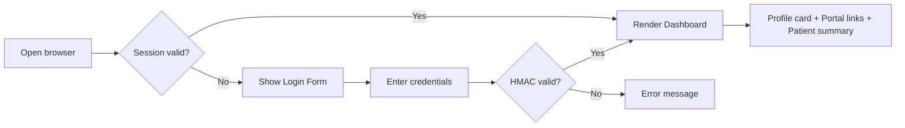

---

### 2. EMR Auto-Fill Engine

Playwright RPA transfers structured clinical data (anamnesis, diagnosis, prescriptions) into ePuskesmas, streaming progress to the frontend via Socket.IO — eliminating double-entry.

**Sequence Diagram:**

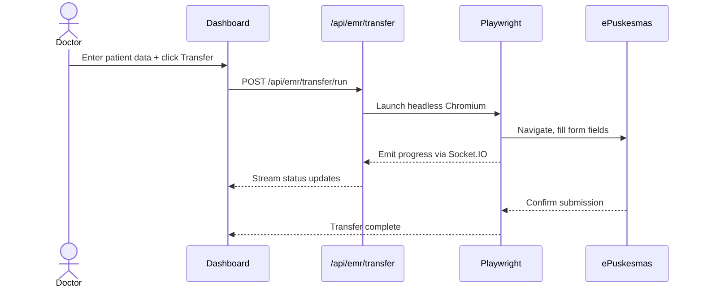

**API Endpoints:**

| Method | Endpoint | Description | Status Codes |
|---|---|---|---|
| `POST` | `/api/emr/transfer/run` | Execute EMR auto-fill | 202, 409, 503 |
| `GET` | `/api/emr/transfer/status` | Engine status | 200 |
| `GET` | `/api/emr/transfer/history` | Run history | 200 |

**Database Schema:**

```sql
CREATE TABLE emr_transfer_runs (
  id            UUID PRIMARY KEY DEFAULT gen_random_uuid(),
  patient_mrn   VARCHAR(32) NOT NULL,
  initiated_by  VARCHAR(64) NOT NULL,
  status        VARCHAR(16) NOT NULL,   -- pending | running | success | failed
  payload       JSONB NOT NULL,
  error_message TEXT,
  started_at    TIMESTAMPTZ DEFAULT now(),
  completed_at  TIMESTAMPTZ,
  duration_ms   INTEGER
);
```

**Security:** EMR credentials are runtime-only (env vars), never logged or client-exposed. Audit log records actor + timestamp without exposing patient PHI in log lines.

---

### 3. ICD-X Finder

Multi-version ICD-10 lookup (2010, 2016, 2019) with fuzzy search, dynamic filtering, and legacy code translation.

**API:** `GET /api/icdx/lookup?q=headache&version=2019&limit=10`

```json
{
  "ok": true,
  "version": 2019,
  "results": [
    { "code": "R51", "description": "Headache", "isBillable": true },
    { "code": "G44.3", "description": "Post-traumatic headache", "isBillable": true }
  ]
}
```

**Database Schema:**

```sql
CREATE TABLE icd10_codes (
  id          SERIAL PRIMARY KEY,
  code        VARCHAR(8) NOT NULL,
  version     SMALLINT NOT NULL,        -- 2010 | 2016 | 2019
  description TEXT NOT NULL,
  category    VARCHAR(3),
  is_billable BOOLEAN DEFAULT true,
  UNIQUE(code, version)
);
CREATE INDEX idx_icd_fts ON icd10_codes
  USING gin(to_tsvector('indonesian', description));
```

---

### 4. LB1 Report Automation

End-to-end pipeline: ingest ePuskesmas export → validate → map ICD-10 to LB1 categories → populate Excel template → output `.xlsx`, QC `.csv`, and audit `.json`.

**Pipeline Flow:**

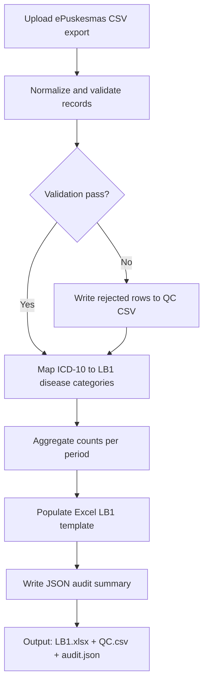

**API Endpoints:**

| Method | Endpoint | Description |
|---|---|---|
| `GET` | `/api/report/automation/preflight` | Pre-run validation |
| `POST` | `/api/report/automation/run` | Execute pipeline |
| `GET` | `/api/report/automation/status` | Pipeline status |
| `GET` | `/api/report/automation/history` | Run history |
| `GET` | `/api/report/files/download` | Download output file |

---

### 5. Audrey — Clinical AI Assistant

Voice-first AI copilot powered by **Google Gemini 2.5 Flash** (native audio). Provides real-time diagnostic insights calibrated for Puskesmas-level resources during patient encounters.

> ⚠️ **Clinical Disclaimer:** Audrey provides AI-assisted suggestions only. All clinical decisions must be made by a licensed healthcare professional.

**API:** `POST /api/voice/chat`

```json
// Request
{
  "message": "Patient G2P1 36wks, BP 150/100, headache. Thoughts?",
  "context": "ANC",
  "sessionId": "session-abc123"
}

// Response
{
  "ok": true,
  "reply": "Consider pre-eclampsia. Check proteinuria, assess for severe features (visual changes, epigastric pain). Per PONED protocol: MgSO4 loading dose if confirmed; prepare urgent referral.",
  "confidence": "high"
}
```

---

### 6. ACARS — Internal Chat

Socket.IO-backed team messaging with room-based conversations, typing indicators, and online presence tracking.

**Real-Time Socket.IO Events:**

| Event | Direction | Payload |
|---|---|---|
| `acars:message` | Server → Client | `{roomId, sender, text, timestamp}` |
| `acars:typing` | Client → Server | `{roomId, username}` |
| `acars:presence` | Server → Client | `{username, status}` |

---

### 7. CDSS — Clinical Decision Support

Combines a local knowledge base (159 diseases, 45,030 encounter records) with Gemini reasoning to deliver ranked differential diagnoses, treatment plans, and referral criteria.

**API:** `POST /api/cdss/diagnose`

```json
// Request
{
  "symptoms": ["headache", "fever", "neck stiffness"],
  "patientAge": 25,
  "patientSex": "female",
  "vitals": { "temp": 38.5, "bp": "120/80" }
}

// Response
{
  "ok": true,
  "differentials": [
    {
      "rank": 1,
      "diagnosis": "Bacterial Meningitis",
      "icdCode": "G00.9",
      "urgency": "emergency",
      "referralRequired": true,
      "immediateActions": ["Urgent hospital referral", "Do not delay for LP"]
    }
  ],
  "disclaimer": "AI-generated. Clinical judgment required."
}
```

---

### 8. Crew Access Portal

Authentication gate using HMAC-SHA256 signed session cookies. Credentials resolved in priority order: `env vars > runtime JSON > compiled defaults`.

**Auth Flow:**

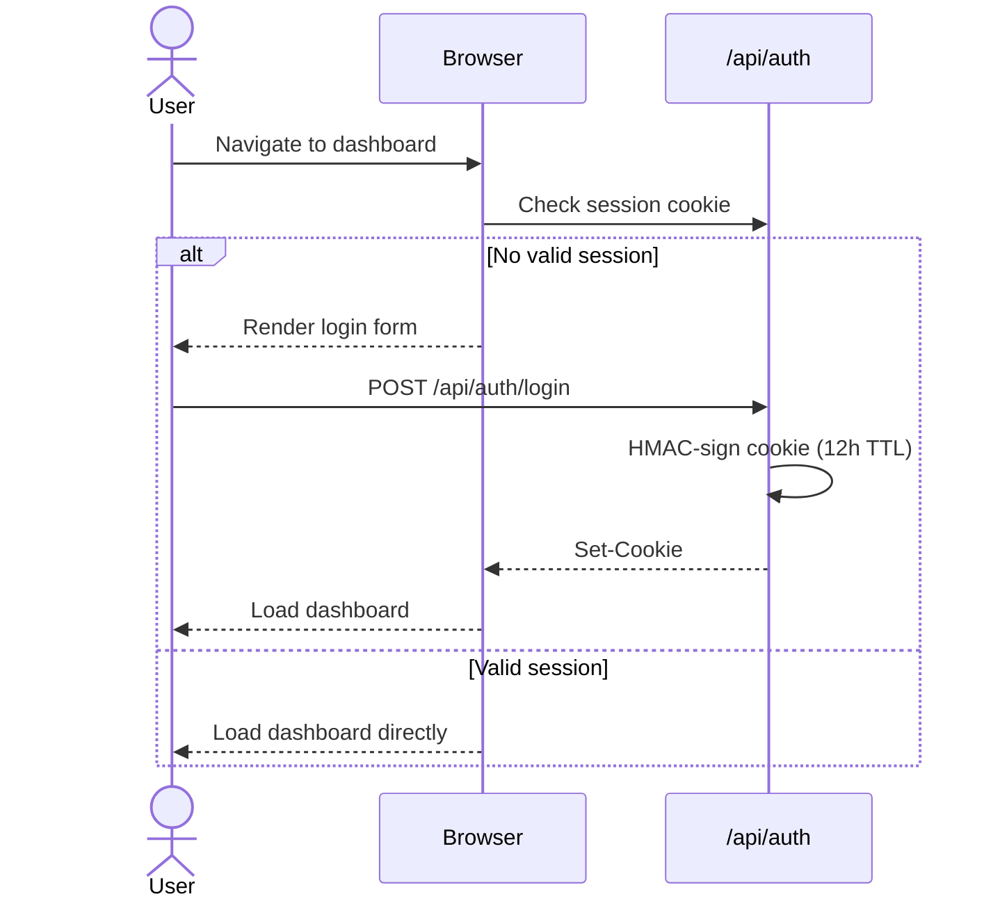

**Security Properties:**

| Property | Value |
|---|---|
| Cookie flags | `HttpOnly`, `Secure`, `SameSite=Strict` |
| HMAC algorithm | SHA-256 |
| Session TTL | 12 hours |
| Rate limiting | 5 login attempts / 15 min (recommended) |

---

### 9. Telemedicine — Virtual Consultation

Real-time video consultations via **WebRTC** peer-to-peer with Socket.IO signaling, STUN/TURN fallback, in-call chat, file sharing, consent-gated recording, and AI-generated post-session SOAP notes.

**Consultation Workflow:**

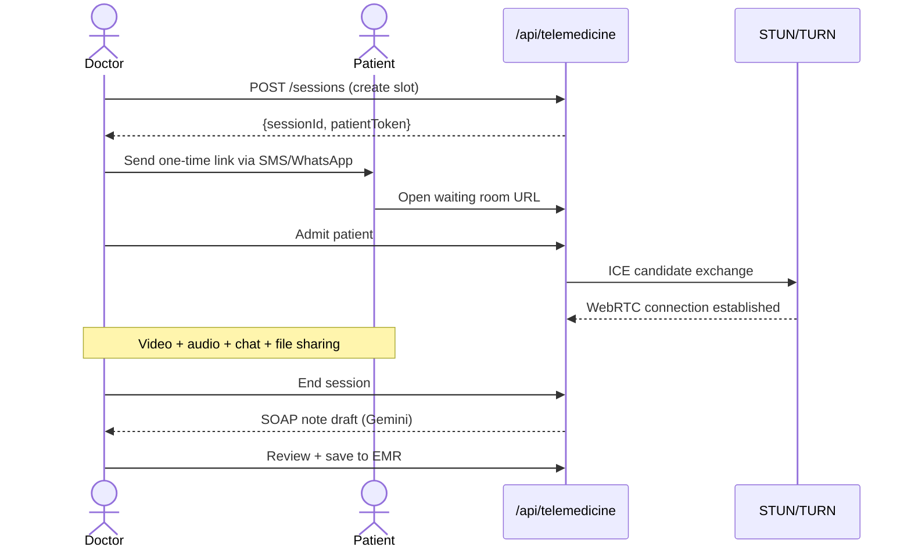

**API Endpoints:**

| Method | Endpoint | Description |
|---|---|---|
| `POST` | `/api/telemedicine/sessions` | Create session |
| `GET` | `/api/telemedicine/sessions` | List sessions |
| `PATCH` | `/api/telemedicine/sessions/:id` | Update status |
| `POST` | `/api/telemedicine/signal` | WebRTC signaling |
| `POST` | `/api/telemedicine/recording/start` | Start recording |
| `POST` | `/api/telemedicine/recording/stop` | Stop & save |
| `GET/POST` | `/api/telemedicine/schedule` | Slot management |

**Database Schema:**

```sql
CREATE TABLE telemedicine_sessions (
  id              UUID PRIMARY KEY DEFAULT gen_random_uuid(),
  doctor_id       VARCHAR(64) NOT NULL,
  patient_token   VARCHAR(128) UNIQUE NOT NULL,
  patient_name    VARCHAR(128),
  status          VARCHAR(16) DEFAULT 'scheduled',
  scheduled_at    TIMESTAMPTZ,
  started_at      TIMESTAMPTZ,
  ended_at        TIMESTAMPTZ,
  recording_path  TEXT,
  soap_note       TEXT,
  emr_saved       BOOLEAN DEFAULT false,
  created_at      TIMESTAMPTZ DEFAULT now()
);
```

> ⚠️ Recordings contain PHI. Store encrypted (AES-256) at rest. Restrict access to authorized clinical staff only.

---

### 10. Vital Signs Monitoring & Instant Red Alerts

Unified vital signs interface that ingests multi-source readings (manual entry, EMR bridge, device feed) and evaluates them in real time against physiological thresholds. Triggers instant red alerts with severity classification without waiting for CDSS inference.

**Key Capabilities:**
- Composite deterioration detection across 6+ vital parameters simultaneously
- Instant alert generation: SpO₂ < 90%, MAP < 65 mmHg, GCS < 8, etc.
- Velocity (rate-of-change) calculation per vital — detects rapid deterioration
- AVPU ↔ GCS mapping for consciousness level normalization
- Baseline deviation tracking per individual patient

**API:** `GET /api/vitals/history?patientId=&limit=50`

---

### 11. Clinical Trajectory Analysis

Longitudinal engine that tracks patient health vectors across time — combining vital trends, diagnosis history, and encounter outcomes into a clinical trajectory with forward momentum projection.

**Key Capabilities:**
- `TrajectoryIntelligencePanel` — consolidated view of all trajectory signals
- `MomentumScoreCard` — single composite score summarizing clinical direction
- `VitalTrendChart` & `VitalVelocityList` — graphical and tabular trend views
- `AcuteAttackRiskGrid` / `AcuteAttackRiskRadar` — multi-axis acute decompensation risk
- `ClinicalUrgencyMatrix` — classifies urgency from trajectory data

**API:** `GET /api/patients/[id]/trajectory`

---

### 12. Momentum & Deterioration Scoring Engine

Server-side engine (`lib/clinical/momentum-engine.ts`) that calculates a single normalized momentum score per patient encounter, representing the net clinical direction (improving / stable / deteriorating).

**Score Interpretation:**

| Score Range | Clinical State |
|---|---|
| > +0.6 | Improving |
| -0.2 to +0.6 | Stable |
| < -0.2 | Deteriorating |
| < -0.6 | Critical — immediate action |

**Inputs:** vital velocity, baseline deviation, CDSS urgency grade, diagnosis acuity weight.

---

### 13. Time-to-Critical Prediction

`lib/clinical/prediction-engine.ts` extrapolates current vital velocity vectors to estimate time-to-critical threshold breach. Used in `TimeToCriticalTimeline` component and `MortalityRiskIndicator`.

**Key Capabilities:**
- Per-vital time-to-threshold calculation (SpO₂, MAP, GCS, temperature)
- Mortality risk percentile based on convergence pattern score
- Acute attack window estimation for chronic disease exacerbations
- Forward projection horizon: configurable (default 4h, max 24h)

---

### 14. Convergence Pattern Detection

`lib/clinical/convergence-detector.ts` detects when multiple vital parameters deteriorate in the same time window — a known predictor of rapid decompensation — even before any single vital crosses its threshold.

**Pattern Types:**

| Pattern | Description |
|---|---|
| `vital-convergence` | 3+ vitals deteriorating within 30 min |
| `tachycardia-hypotension` | HR ↑ + BP ↓ together |
| `hypoxia-tachypnea` | SpO₂ ↓ + RR ↑ together |
| `altered-consciousness` | GCS drop ≥ 2 in < 1h |

**Components:** `ConvergenceHeatmap`, `ConvergencePatternAlert`, `BaselineDeviationGauge`.

---

### 15. NEWS2 Early Warning Score

Full National Early Warning Score 2 implementation (`lib/cdss/news2.ts`) — aggregates 7 physiological parameters into a composite score driving escalation decisions.

**Scoring Parameters:** Respiration rate · SpO₂ · Supplemental O₂ · Temperature · Systolic BP · Heart rate · Consciousness (ACVPU)

**Escalation Thresholds:**

| NEWS2 Score | Response |
|---|---|
| 0–4 | Routine monitoring |
| 5–6 or any single ≥ 3 | Urgent medical review |
| ≥ 7 | Emergency — continuous monitoring, senior clinician |

---

### 16. Disease Classifiers

Three standalone inference modules for common primary healthcare conditions:

| Module | File | Input | Output |
|---|---|---|---|
| Glucose Classifier | `lib/glucose-classifier.ts` | Fasting/PP glucose + HbA1c | Normal / Prediabetes / DM Type 2 |
| Hypertension Classifier | `lib/htn-classifier.ts` | Systolic + diastolic BP | Grade 1/2/3, Isolated Systolic |
| Occult Shock Detector | `lib/occult-shock-detector.ts` | HR, BP, SpO₂, GCS, skin signs | Alert / No alert |

Used by CDSS engine and Trajectory Analyzer as pre-filter inputs.

---

### 17. Critical Mind — Clinical Reasoning Interface

Dedicated reasoning workspace (`/critical-mind`) for complex case analysis. Integrates CDSS differentials, trajectory data, and Audrey AI into a single structured clinical reasoning session.

**Key Capabilities:**
- Free-text clinical problem formulation with AI scaffolding
- Pulls live trajectory data for the active patient
- Side-by-side differential diagnosis from CDSS
- Structured output: Problem → Assessment → Plan → Disposition

---

### 18. Medical Calculators

18 validated clinical calculators accessible at `/calculator/[slug]` with input forms, computed results, and clinical interpretation.

**Available Calculators:**

| Slug | Calculator | Clinical Use |
|---|---|---|
| `bmi-calculator` | Body Mass Index | Nutritional screening |
| `map-calculation` | Mean Arterial Pressure | Perfusion assessment |
| `basal-metabolic-rate` | Basal Metabolic Rate | Caloric needs estimation |
| `egfr-ckd-epi` | eGFR (CKD-EPI) | CKD staging |
| `creatinine-clearance` | Cockcroft-Gault | Drug dose adjustment |
| `due-date-lmp` | Estimated Due Date | Obstetric estimation |
| `qsofa-score` | qSOFA | Sepsis triage |
| `glasgow-coma-scale` | Glasgow Coma Scale | Neurological severity |
| `curb-65` | CURB-65 | CAP severity (hospital vs home) |
| `cha2ds2-vasc` | CHA₂DS₂-VASc | AF stroke risk, anticoagulation |
| `hasbled` | HAS-BLED | Bleeding risk in anticoagulation |
| `timi-ua-nstemi` | TIMI UA/NSTEMI | Chest pain stratification |
| `wells-dvt` | Wells DVT | DVT pre-test probability |
| `wells-pe` | Wells PE | PE pre-test probability |
| `centor-score` | Centor Modified | Group A Strep, antibiotic decision |
| `phq-9` | PHQ-9 | Depression screening |
| `pediatric-weight` | Ideal Pediatric Weight | Pediatric dosing |
| `corrected-sodium` | Corrected Sodium | Hyperglycemia sodium correction |

---

### 19. Consultation Request & EMR Transfer Flow

Structured workflow for inbound consultation requests (via telemedicine or direct referral), managing accept/reject decisions and one-click transfer of consultation outcomes to the EMR bridge.

**API Endpoints:**

| Method | Endpoint | Description |
|---|---|---|
| `GET` | `/api/consult/pending` | List pending consultations |
| `POST` | `/api/consult/accept` | Accept consultation |
| `POST` | `/api/consult/reject` | Reject with reason |
| `POST` | `/api/consult/transfer-to-emr` | Push outcome to EMR bridge |

**State Machine:** `pending` → `accepted` / `rejected` → `transferred` / `closed`

---

### 20. Clinical Report Generator

Generates structured clinical PDF reports from encounter and CDSS data, stored server-side and downloadable on demand.

**API Endpoints:**

| Method | Endpoint | Description |
|---|---|---|
| `GET/POST` | `/api/report/clinical` | List / create report |
| `GET` | `/api/report/clinical/[id]/pdf` | Generate + download PDF |

---

### 21. AI Insights & Clinical Narrative Generator

`lib/intelligence/ai-insights.ts` + `lib/narrative-generator.ts` — produces human-readable clinical summaries from structured encounter data. Used to populate SOAP note drafts after telemedicine sessions and generate shift handoff summaries.

**Capabilities:**
- SOAP note generation (Subjective / Objective / Assessment / Plan)
- Shift handoff narrative from encounter queue
- Trajectory summary paragraph for patient charts
- Powered by Gemini 2.5 Flash with clinical prompt engineering

---

### 22. Anamnesis Extractor

`lib/clinical/anamnesis-extractor.ts` — NLP pipeline that parses free-text clinical notes (Indonesian or English) into structured EMR fields: chief complaint, duration, associated symptoms, pertinent negatives, past medical history.

**API:** `POST /api/clinical/anamnesis/extract`

```json
// Request
{ "text": "Pasien datang dengan keluhan demam 3 hari, batuk berdahak, sesak napas..." }

// Response
{
  "chiefComplaint": "demam",
  "duration": "3 hari",
  "associatedSymptoms": ["batuk berdahak", "sesak napas"],
  "pertinentNegatives": []
}
```

---

### 23. Hub — Crew Directory & Profiles

Staff directory at `/hub` with individual crew profiles, role cards, and lab result linkage. Supports multi-institution view for facility administrators.

**API Endpoints:**

| Method | Endpoint | Description |
|---|---|---|
| `GET` | `/api/hub/roster` | Full crew roster |
| `GET` | `/api/hub/roster/[username]` | Individual crew profile |
| `GET` | `/api/crew/[username]` | Crew access metadata |
| `GET` | `/api/hub/lab/[username]` | Lab results for crew member |

---

### 24. Admin Console

Full administrative back-office at `/admin` for managing users, institutions, and registration approvals, with overview metrics and dev-update publishing.

**API Endpoints:**

| Method | Endpoint | Description |
|---|---|---|
| `GET` | `/api/admin/overview` | Dashboard metrics |
| `CRUD` | `/api/admin/users` | User management |
| `POST` | `/api/admin/users/[u]/reset-password` | Password reset |
| `POST` | `/api/admin/users/[u]/deactivate` | Deactivate account |
| `CRUD` | `/api/admin/institutions` | Institution CRUD |
| `POST` | `/api/admin/registrations/[id]/approve` | Approve pending registration |
| `CRUD` | `/api/admin/dev-updates` | Publish dev updates to staff |
| `CRUD` | `/api/admin/notam` | Manage NOTAMs |

---

### 25. NOTAM — Operational Notices System

Aviation-inspired Notice-to-All-Members system for broadcasting operational updates (system maintenance, protocol changes, emergencies) to all authenticated staff in real time via Socket.IO.

**API Endpoints:**

| Method | Endpoint | Description |
|---|---|---|
| `GET` | `/api/notam/active` | Active NOTAMs for current staff |
| `CRUD` | `/api/admin/notam` | Admin NOTAM management |

**Real-time:** `notam:broadcast` Socket.IO event pushes new NOTAMs to all connected clients instantly.

---

### 26. Staff Geographic Map

`components/map/StaffMap.tsx` — visualizes staff locations and active duty coverage geographically. Used by administrators to monitor field deployment of clinical staff across service areas.

---

### 27. Online Status Tracker

`lib/server/online-today-tracker.ts` + `GET /api/doctors/online` — tracks and exposes real-time online presence of clinical staff. Used by telemedicine scheduler to show doctor availability and by ACARS for presence indicators.

---

### 28. Security Audit Log

`lib/server/security-audit.ts` — append-only structured log of all security-relevant events: authentication attempts, CDSS access, admin actions. PHI-safe by design: user identifiers are SHA-256 hashed before storage.

**Log Entry Schema:**

```json
{
  "timestamp": "2026-04-15T13:21:00.000Z",
  "endpoint": "/api/cdss/diagnose",
  "action": "cdss_diagnose",
  "result": "success",
  "userId": "sha256:a3f2...",
  "role": "doctor",
  "ip": "10.0.0.1",
  "metadata": { "suggestionCount": 3, "redFlagCount": 1 }
}
```

> Patient identifiers, names, and clinical content are **never** written to the audit log.

---

### 29. Screening Audit Logbook

`lib/audit/screening-audit-service.ts` + `lib/audit/screening-immutable-hash.ts` — immutable audit chain for clinical screening events. Each entry is hash-chained to the previous, making retroactive tampering detectable.

**Routes:** `GET/POST /api/v1/logs/screening` · `GET /api/v1/logs/screening/[eventId]` · `POST /api/v1/logs/screening/[eventId]/ack`

---

### 30. Role-Based Access Control (RBAC)

Role enforcement at API route and component level. Roles: `doctor` · `midwife` · `nurse` · `admin` · `patient`.

| Resource | doctor | midwife | nurse | admin |
|---|---|---|---|---|
| CDSS diagnose | ✅ | ✅ | ❌ | ❌ |
| EMR transfer | ✅ | ✅ | ✅ | ❌ |
| Admin console | ❌ | ❌ | ❌ | ✅ |
| Telemedicine host | ✅ | ✅ | ❌ | ❌ |
| Screening logbook | ✅ | ✅ | ✅ | ✅ |

Implemented in `lib/telemedicine/rbac.ts` and API route guards via `getCrewAccessConfigStatus()`.

---

### 31. Intelligence Dashboard (Socket.io Live Feeds)

`/dashboard/intelligence` — real-time operational overview streaming live encounter queue, active alerts, vital sign updates, and CDSS activity via Socket.IO. Zero polling — push-only from server.

**Socket Events:**

| Event | Direction | Description |
|---|---|---|
| `intelligence:encounter-update` | Server → Client | New/updated encounter in queue |
| `intelligence:alert` | Server → Client | New red alert or CDSS escalation |
| `intelligence:metrics` | Server → Client | Operational KPI snapshot |
| `intelligence:override` | Client → Server | Manual flag override by clinician |

**API:** `GET /api/dashboard/intelligence/metrics` · `GET /api/dashboard/intelligence/observability`

---

### 32. Multi-Bridge Real-time Architecture

Three independent Socket.IO namespaces bridge server-side events to the frontend without REST polling:

| Bridge | File | Namespace | Feeds |
|---|---|---|---|
| Intelligence | `lib/intelligence/socket-bridge.ts` | `/intelligence` | Encounter queue, alerts, metrics |
| EMR | `lib/emr/socket-bridge.ts` | `/emr` | Transfer progress, sync status |
| Telemedicine | `lib/telemedicine/socket-bridge.ts` | `/telemedicine` | Call state, consultation events |
| NOTAM | `lib/notam/socket-bridge.ts` | `/notam` | Broadcast operational notices |

All bridges authenticate via the same HMAC session cookie before accepting connections (`lib/server/crew-access-auth.ts`).

---

### 33. Langfuse Artificial Intelligence Observability

`lib/intelligence/langfuse.config.ts` — traces every Gemini inference call (CDSS, Audrey, narrative generation) through Langfuse for latency monitoring, token usage, prompt versioning, and quality scoring.

**Captured per AI call:** model name · prompt version · input tokens · output tokens · latency ms · user role · session ID (hashed)

> Patient data is never sent to Langfuse. Only structural metadata is traced.

---

### 34. Sentry Error Tracking (PHI-Scrubbed)

`lib/intelligence/sentry.config.ts` — Sentry integration with a mandatory `beforeSend` hook that scrubs PHI from every event before transmission.

**Scrubbed field patterns:** `patientId` · `patientName` · `fullName` · `medicalRecordNumber` · `mrn` · `nik`

**Value scrubbing:** 16-digit NIK → `[REDACTED-NIK]` · MRN patterns → `[REDACTED-MRN]`

**Disabled by policy:** `replaysSessionSampleRate = 0` · `replaysOnErrorSampleRate = 0` (no session recording)

---

### 35. Health Check API

`GET /api/health` — structured health check endpoint used by Railway, uptime monitors, and CI/CD pipelines. Returns per-dependency status with HTTP 200 (healthy/degraded) or 503 (critical failure).

**Response Schema:**

```json
{
  "status": "ok | degraded | error",
  "service": "intelligenceboard",
  "timestamp": "2026-04-15T13:00:00.000Z",
  "environment": "production",
  "release": "abc1234",
  "checks": {
    "database": { "ok": true, "required": true },
    "crew_access": { "ok": true, "required": true },
    "cdss_ai": { "ok": true, "required": false },
    "livekit": { "ok": false, "required": false },
    "sentry": { "ok": true, "required": false }
  }
}
```

HTTP 503 only when a `required: true` check fails. Degraded state returns HTTP 200 with `"status": "degraded"`.

---

## System Architecture

### Architecture Diagram

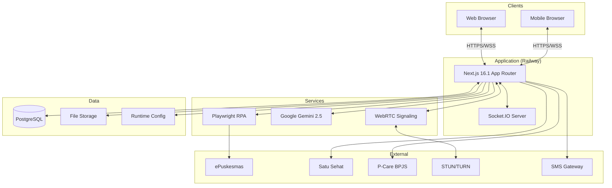

### Deployment Recommendation

**Recommended: Enhanced Monolith (current) → Modular Monolith (v2)**

| Approach | Verdict | Reason |
|---|---|---|
| Monolith | ✅ Now | Simple ops, fits current team and scale |
| Microservices | ❌ Premature | Operational overhead not justified |
| Serverless | ❌ Incompatible | Socket.IO and WebRTC require persistent connections |

At >50 concurrent users, extract Playwright RPA and CDSS inference to separate background worker processes.

### Scaling Strategy

- **Stateless API routes** → horizontally scalable (HMAC cookies, no server-side session store)
- **Socket.IO + Redis Adapter** → multi-instance real-time when scaling beyond one process
- **Playwright worker pool** → max 3 concurrent RPA jobs to prevent resource exhaustion
- **ICD-10 cache** → Redis with 24h TTL reduces DB read pressure

---

## Project Structure
## Project Structure

```bash
intelligenceBoard/
├── server.ts                  # Custom HTTP + Socket.IO server entry
├── next.config.ts
├── tsconfig.json              # TypeScript strict mode
├── railway.toml
├── package.json
│
├── src/
│   ├── app/
│   │   ├── layout.tsx         # Root layout (ThemeProvider + CrewAccessGate + AppNav)
│   │   ├── page.tsx           # Home / Profile Dashboard
│   │   ├── globals.css        # Dark/light theme tokens
│   │   ├── emr/               # EMR Auto-Fill UI
│   │   ├── icdx/              # ICD-X lookup UI
│   │   ├── report/            # LB1 report UI
│   │   ├── voice/             # Audrey voice UI
│   │   ├── acars/             # Internal chat UI
│   │   ├── pasien/            # Patient records UI
│   │   ├── telemedicine/      # Telemedicine UI
│   │   └── api/               # All route handlers
│   │       ├── auth/
│   │       ├── emr/
│   │       ├── icdx/
│   │       ├── report/
│   │       ├── voice/
│   │       ├── cdss/
│   │       └── telemedicine/
│   │
│   ├── components/
│   │   ├── AppNav.tsx
│   │   ├── CrewAccessGate.tsx
│   │   ├── ThemeProvider.tsx
│   │   └── ui/
│   │       ├── Button.tsx
│   │       ├── Card.tsx
│   │       └── DataTable.tsx
│   │
│   └── lib/
│       ├── crew-access.ts     # Auth types/constants
│       ├── server/            # Server-only auth logic
│       ├── lb1/               # LB1 pipeline engine
│       ├── emr/               # EMR RPA engine + Playwright
│       ├── icd/               # ICD-10 database
│       └── telemedicine/      # WebRTC, signaling, SOAP generator
│
├── docs/plans/                # Design documents
├── runtime/                   # Gitignored — secrets & configs
└── mintlify-docs/             # Public API documentation
```

## API Reference

All routes prefixed `/api`. Authentication via HMAC-signed session cookie required on all routes.

### Full Endpoint Table

| Method | Endpoint | Module | Description |
|---|---|---|---|
| `POST` | `/api/auth/login` | Auth | Authenticate staff |
| `POST` | `/api/auth/logout` | Auth | End session |
| `GET` | `/api/auth/session` | Auth | Validate session |
| `POST` | `/api/emr/transfer/run` | EMR | Run auto-fill |
| `GET` | `/api/emr/transfer/status` | EMR | Engine status |
| `GET` | `/api/emr/transfer/history` | EMR | Run history |
| `GET` | `/api/icdx/lookup` | ICD-X | Code search |
| `GET` | `/api/report/automation/preflight` | LB1 | Pre-run check |
| `POST` | `/api/report/automation/run` | LB1 | Execute pipeline |
| `GET` | `/api/report/automation/status` | LB1 | Status |
| `GET` | `/api/report/automation/history` | LB1 | History |
| `GET` | `/api/report/files/download` | LB1 | Download output |
| `GET/POST/DELETE` | `/api/report/clinical` | Clinical | CRUD reports |
| `POST` | `/api/cdss/diagnose` | CDSS | Differential Dx |
| `POST` | `/api/voice/chat` | Voice | Chat with Audrey |
| `POST` | `/api/voice/tts` | Voice | Text-to-speech |
| `GET` | `/api/voice/token` | Voice | Session token |
| `POST` | `/api/telemedicine/sessions` | Tele | Create session |
| `GET` | `/api/telemedicine/sessions` | Tele | List sessions |
| `PATCH` | `/api/telemedicine/sessions/:id` | Tele | Update session |
| `POST` | `/api/telemedicine/signal` | Tele | WebRTC signaling |
| `POST` | `/api/telemedicine/recording/start` | Tele | Start recording |
| `POST` | `/api/telemedicine/recording/stop` | Tele | Stop recording |
| `GET/POST` | `/api/telemedicine/schedule` | Tele | Slot management |

---

## Security & Privacy

### Authentication & Authorization

| Property | Implementation |
|---|---|
| Mechanism | HMAC-SHA256 signed session cookies |
| TTL | 12 hours |
| Cookie flags | `HttpOnly`, `Secure`, `SameSite=Strict` |
| Role enforcement | API route-level (`doctor`, `midwife`, `nurse`, `admin`) |
| Future upgrade | OAuth2/OIDC via Keycloak or Auth0 |

### Encryption & Secrets

| Layer | Mechanism |
|---|---|
| In transit | TLS 1.3 (Railway/CDN enforced) |
| At rest (recordings) | AES-256 |
| Secrets | Railway environment vault |
| Cookie | HMAC-SHA256 signature |

### Compliance Notes

- **Indonesia:** Align with UU No. 17/2023 (Kesehatan) and applicable Permenkes
- **GDPR equivalence:** Data minimization, purpose limitation, right-to-erasure
- **Consent:** Explicit patient consent required for telemedicine recording and data sharing
- **Audit logging:** `{timestamp, actor, action, resource_type, resource_id}` — no patient name/MRN in log lines

### Threat Mitigations

| Threat | Mitigation |
|---|---|
| Session forgery | HMAC-signed cookies, server-side validation |
| Brute force login | Rate limit: 5 req / 15 min on `/api/auth/login` |
| XSS | Next.js CSP headers, no `dangerouslySetInnerHTML` |
| SQL injection | Parameterized queries via ORM |
| SSRF (Playwright) | URL allowlist for RPA targets |
| PHI leak | No identifiers in logs; PHI encrypted at rest |

---

## Operations & Deployment

### Railway Deployment

```toml
# railway.toml
[build]
builder = "nixpacks"
buildCommand = "npm run build"

[deploy]
startCommand = "npm run start"
restartPolicyType = "on_failure"
restartPolicyMaxRetries = 3
```

**Steps:** Push to GitHub → Connect to Railway → Set all env vars → Auto-deploys on `master` push.

### CI/CD (Recommended)

```yaml
# .github/workflows/ci.yml
name: CI
on: [push, pull_request]
jobs:
  build:
    runs-on: ubuntu-latest
    steps:
      - uses: actions/checkout@v4
      - uses: actions/setup-node@v4
        with: { node-version: '20' }
      - run: npm ci
      - run: npm run build
```

### Observability

| Signal | Tool | Key Alert Thresholds |
|---|---|---|
| Logs | Railway structured logs | Error rate > 5% / 5 min |
| Metrics | Railway metrics | Memory > 85% sustained 10 min |
| Tracing (recommended) | OpenTelemetry + Jaeger | Response time > 2s avg |

### Backup & Recovery

| Data | Frequency | Recovery |
|---|---|---|
| PostgreSQL | Daily `pg_dump` to S3 | Restore from latest dump |
| LB1 output files | Retained 12 months | Download from file storage |
| Telemedicine recordings | Per institutional policy | Restore from encrypted S3 |

---

## Developer Guide

### Local Setup

```bash
git clone https://github.com/Claudesy/intelligenceBoard.git
cd intelligenceBoard
npm install && npx playwright install chromium
cp .env.example .env.local
npm run dev
```

### Database Seeds

```bash
npm run db:seed:icd       # Seed ICD-10 all versions
npm run db:seed:patients  # Anonymized dummy patients
npm run db:reset          # Full reset
```

### Commit Convention
type(scope): short imperative description

Types: feat | fix | chore | docs | refactor | test | perf

text

### PR Checklist

- [ ] `npm run build` passes with zero TypeScript errors
- [ ] No secrets in diff
- [ ] New features have test cases
- [ ] API changes updated in endpoint table
- [ ] `.env.example` updated for new variables
- [ ] `CHANGELOG.md` updated

### Available Scripts

| Script | Description |
|---|---|
| `npm run dev` | Dev server with Socket.IO (port 7000) |
| `npm run dev:next` | Next.js only (no Socket.IO) |
| `npm run build` | Production bundle |
| `npm run start` | Production server |
| `npm run docs:dev` | Mintlify preview (port 3004) |
| `npm run docs:api` | Regenerate OpenAPI spec |

---

## Assumptions & Open Questions

| # | Assumption | Impact if Wrong |
|---|---|---|
| A1 | ANC protocols follow Kemenkes RI 2020 guidelines | Audrey/CDSS responses need recalibration |
| A2 | ePuskesmas has no public REST API | If API exists, replace RPA with direct calls |
| A3 | Concurrent users < 50; monolith is sufficient | Redesign needed above this threshold |
| A4 | PostgreSQL is intended primary DB | Schema must be confirmed |
| A5 | TURN server provisioned separately | WebRTC fails in restricted networks without it |

**Open Questions (up to 5):**
1. Which specific Kemenkes ANC checklist should Audrey and CDSS follow per trimester?
2. Is PostgreSQL live in production, or still file-backed? Migration timeline?
3. Multi-facility expansion to other Puskesmas networks — planned rollout strategy?
4. SMS/WhatsApp gateway preference (Twilio, WATI, local provider)?
5. Has the regional Dinas Kesehatan reviewed the system? Any data localization requirements per Permenkes?

---

## Related Documentation

| Document | Description |
|---|---|
| [ARCHITECTURE.md](./ARCHITECTURE.md) | Full architecture breakdown |
| [CONTRIBUTING.md](./CONTRIBUTING.md) | Dev workflow and conventions |
| [CHANGELOG.md](./CHANGELOG.md) | Version history |
| [SECURITY.md](./SECURITY.md) | Vulnerability reporting policy |
| [DISCLAIMER.md](./DISCLAIMER.md) | Clinical and liability disclaimer |
| [DATA_PRIVACY.md](./DATA_PRIVACY.md) | Privacy commitments |
| [MODEL_CARD.md](./MODEL_CARD.md) | AI model summary |
| [docs/DEPLOYMENT.md](./docs/DEPLOYMENT.md) | Deployment operations |
| [mintlify-docs/](./mintlify-docs/) | Public API documentation |

---

## License

**MIT License** — See [`LICENSE`](./LICENSE).

Clinical use is subject to institutional policy, Indonesian law, and disclaimers in [`DISCLAIMER.md`](./DISCLAIMER.md).

> Copyright © 2026 **Claudesy** — dr. Claudesy

---

<div align="center">

Built with care for frontline healthcare workers in Indonesia. 🇮🇩

_Architect & Built by [Claudesy](https://github.com/Claudesy)_

</div>
DESIGN.md — System & UI Design Reference
text
# DESIGN.md — Puskesmas Intelligence Dashboard

> Deep-dive system design, UX guidelines, and architecture rationale.
> Companion to [README.md](./README.md).

---

## Table of Contents

- [ER Diagram](#er-diagram)
- [Critical Flow Diagrams](#critical-flow-diagrams)
- [UX & Visual Design Guidelines](#ux--visual-design-guidelines)
- [Component Design System](#component-design-system)
- [Primary Screen Wireframes](#primary-screen-wireframes)
- [Tech Stack Rationale](#tech-stack-rationale)

---

## ER Diagram

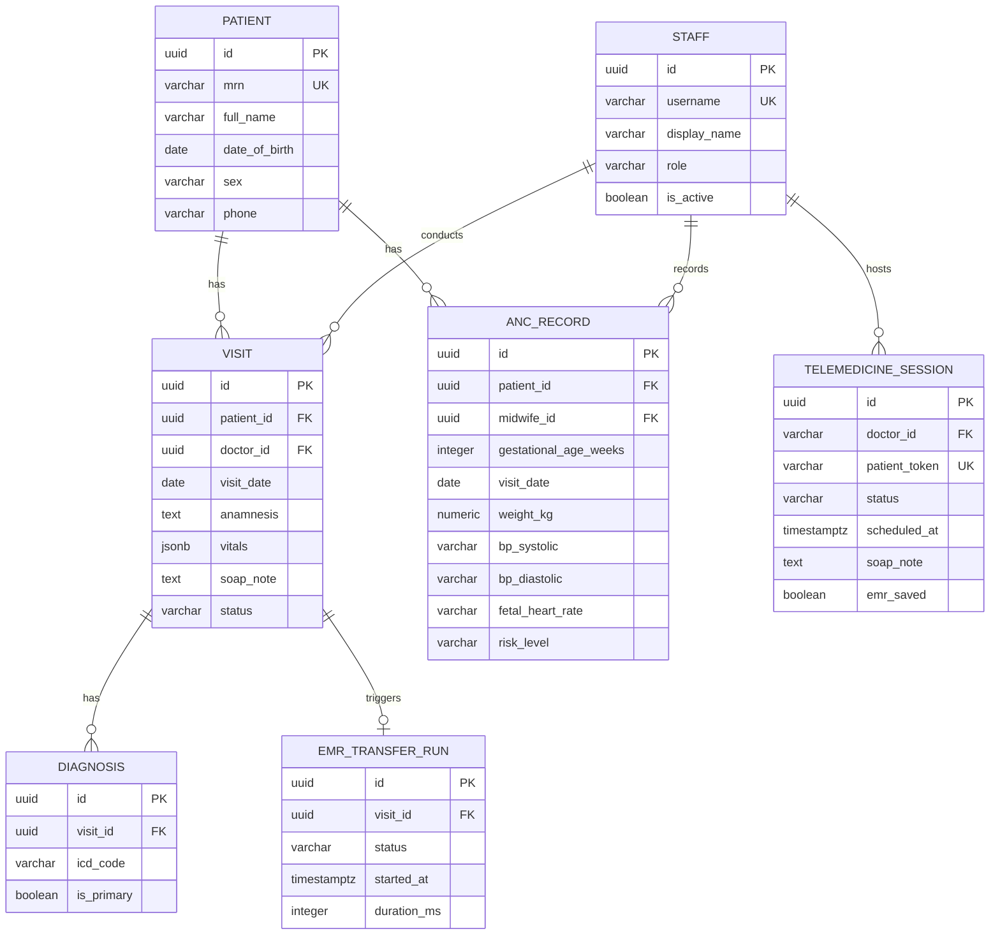

---

## Critical Flow Diagrams

### Patient Registration & First ANC Visit

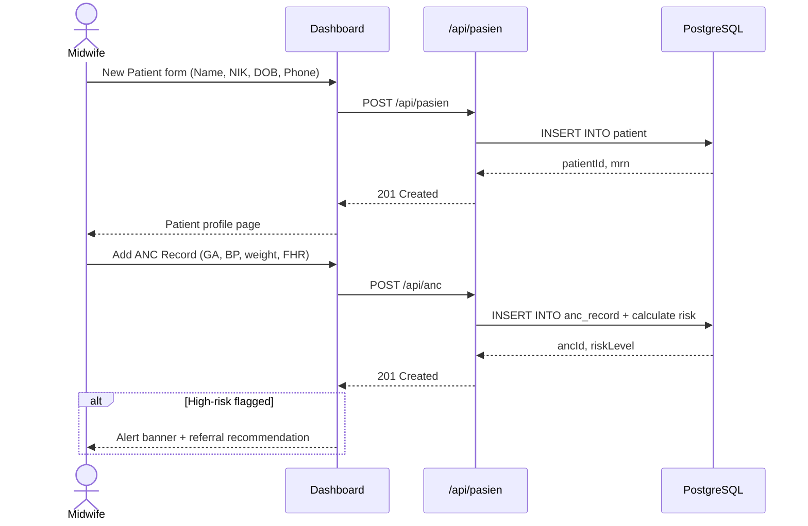

### Emergency Alert Flow

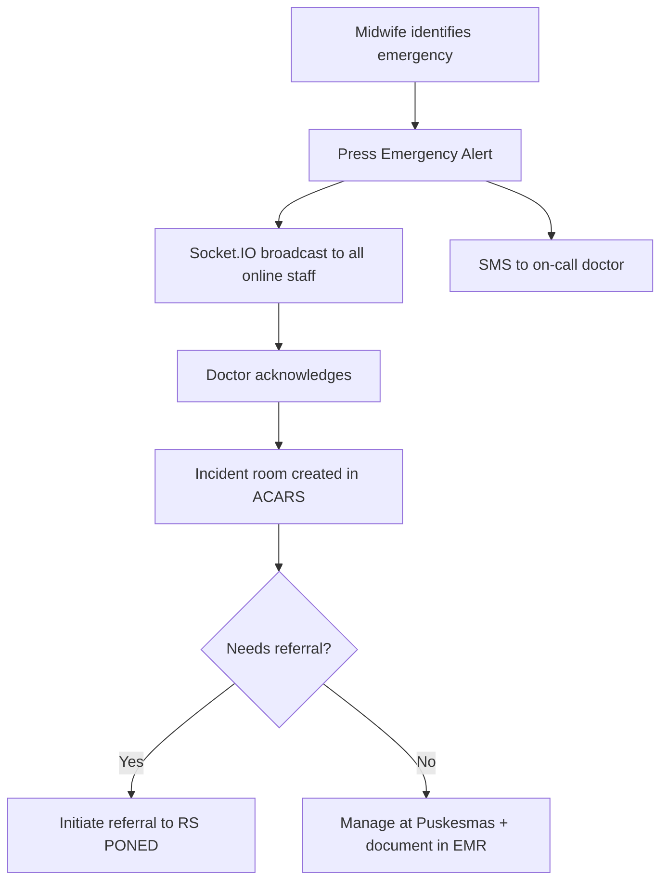

---

## UX & Visual Design Guidelines

### Design Principles

1. **Clinical-first hierarchy** — Patient safety data (alerts, vitals, risk flags) always visually dominant
2. **Mobile-first** — Midwives frequently use tablets at the bedside; all layouts work at 320px+
3. **Accessibility (WCAG 2.1 AA)** — Minimum contrast 4.5:1 body text, 3:1 UI components, keyboard-navigable
4. **Offline resilience (future)** — Core reads via service worker caching

### Color Palette

| Role | Light Mode | Dark Mode | Usage |
|---|---|---|---|
| Primary | `#0066CC` | `#4DA3FF` | CTAs, links, active states |
| Success | `#16A34A` | `#4ADE80` | Normal vitals, completed transfers |
| Warning | `#D97706` | `#FCD34D` | Medium risk, pending actions |
| Danger | `#DC2626` | `#F87171` | High risk, errors, emergencies |
| Text primary | `#111827` | `#F9FAFB` | Body text |
| Surface | `#FFFFFF` | `#1F2937` | Card backgrounds |

### Typography

| Scale | Font | Size | Weight | Use |
|---|---|---|---|---|
| Display | Geist Sans | 32px | 700 | Page titles |
| Heading 1 | Geist Sans | 24px | 600 | Section headers |
| Heading 2 | Geist Sans | 18px | 600 | Card headers |
| Body | Geist Sans | 14px | 400 | Content, table text |
| Mono | Geist Mono | 13px | 400 | ICD codes, MRNs |

### Design Library: Tailwind CSS + shadcn/ui ✅

| Option | Verdict | Reason |
|---|---|---|
| Tailwind + shadcn/ui | ✅ Recommended | Radix primitives (accessible), fully customizable, TypeScript-native |
| Material UI | Neutral | Rich but heavy, opinionated |
| Ant Design | Not recommended | Large bundle, enterprise-heavy aesthetic |

---

## Component Design System

### Key Components

#### `<PatientCard />`

Compact patient summary: MRN badge, name, age, gestational age, risk level chip, last visit.

```tsx
<PatientCard
  mrn="PKM-2026-00123"
  name="Ny. Sari Dewi"
  age={28}
  gestationalAge="36 weeks"
  riskLevel="high"    // 'low' | 'medium' | 'high'
  lastVisit="2026-04-14"
/>
```

Risk level maps to color: `low` → green, `medium` → amber, `high` → red.

#### `<VitalsBadge />`

Color-coded vitals display with threshold-based status indicators.

```tsx
<VitalsBadge
  bp={{ systolic: 150, diastolic: 100 }}  // red — hypertensive
  heartRate={98}                           // green — normal
  temp={37.2}                              // green — normal
/>
```

#### `<TransferStatus />`

Real-time Socket.IO-driven progress bar for EMR transfers. Three states: `idle`, `running` (animated progress), `complete`/`failed` (toast notification).

---

## Primary Screen Wireframes

### Dashboard (Home)

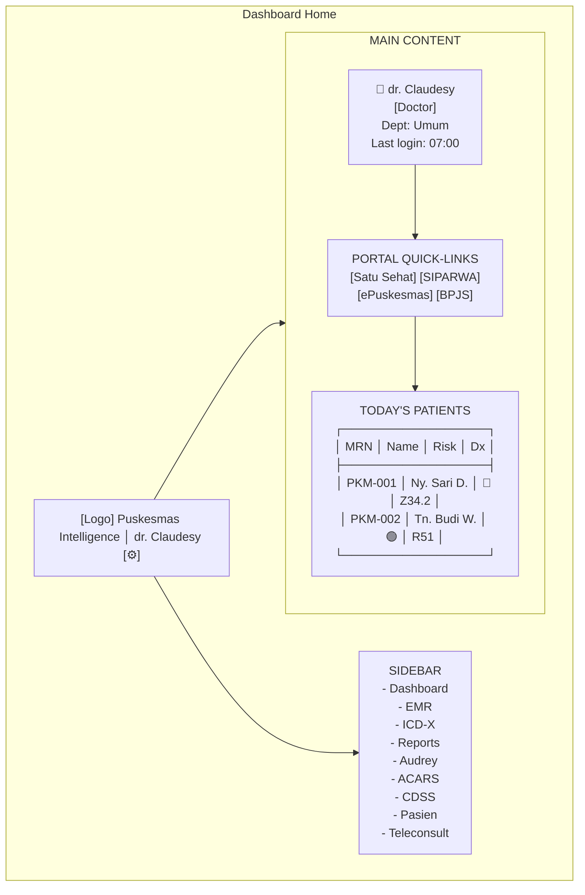

### ANC Record Form

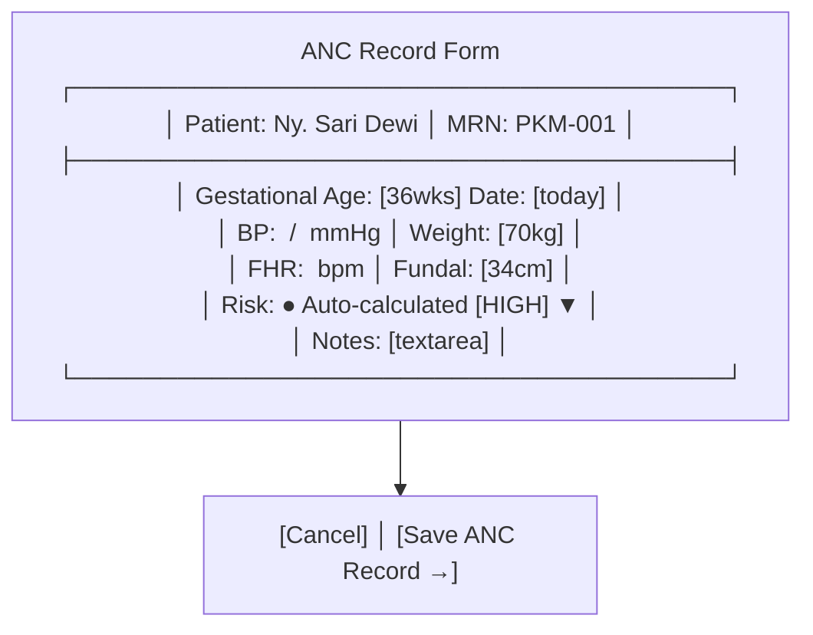

### Telemedicine Waiting Room (Patient)

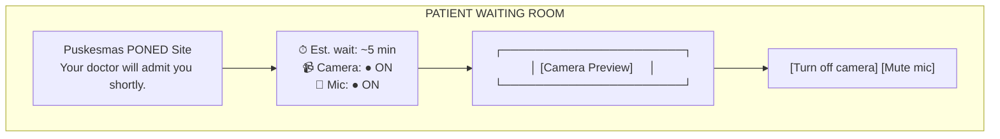

---

## Tech Stack Rationale

| Layer | Choice | Rationale |
|---|---|---|
| Framework | Next.js 16 (App Router) | File-based routing, server components, built-in API routes |
| Language | TypeScript strict | Type safety critical in health data systems |
| Real-time | Socket.IO | Mature, reliable, room-scoped events; works with custom Node server |
| AI | Google Gemini 2.5 Flash | Native audio support (required for Audrey), fast inference |
| RPA | Playwright | Only viable integration path for ePuskesmas (no public API) |
| Spreadsheet | SheetJS | Battle-tested Excel I/O for LB1 template population |
| DB | PostgreSQL | ACID compliance critical for clinical records |
| Deployment | Railway | Zero-config, Git-native, supports custom HTTP server |
| UI | Tailwind + shadcn/ui | Accessible primitives, TypeScript-first, dark mode native |

---

> **Image assets to export (SVG/PNG):**
> - `docs/assets/architecture-diagram.svg` — System context diagram
> - `docs/assets/er-diagram.svg` — Entity-relationship diagram
> - `docs/assets/dashboard-wireframe.png` — Dashboard screen mockup
> - `docs/assets/anc-form-wireframe.png` — ANC record form mockup
> - `docs/assets/telemedicine-wireframe.png` — Waiting room mockup
--

## License

Copyright 2026 **Claudesy** (Dr. Claudesy)

Licensed under the **Apache License, Version 2.0** (the "License"); you may not
use files in this repository except in compliance with the License.

You may obtain a copy of the License at:

> http://www.apache.org/licenses/LICENSE-2.0

### What This Means

| Permission | Requirement |
|------------|-------------|
| ✅ Commercial use | Preserve copyright notice |
| ✅ Modify freely | State all changes made |
| ✅ Distribute copies | Include the full Apache 2.0 license text |
| ✅ Sublicense | Distribute under the same Apache 2.0 terms |
| ✅ Private use | No requirement to disclose source |
| ✅ Patent use | Contributors grant explicit patent rights |

**Patent Protection:** Apache 2.0 includes an explicit patent grant from every
contributor. If any entity initiates patent litigation claiming that a
contribution in this repository constitutes patent infringement, that entity's
patent license is automatically terminated.

Unless required by applicable law or agreed to in writing, software distributed
under the License is distributed on an **"AS IS" BASIS, WITHOUT WARRANTIES OR
CONDITIONS OF ANY KIND**, either express or implied. See the [LICENSE](./LICENSE)
file for the full text governing permissions and limitations.

---

**Version:** 0.0.1  
**Last Updated:** 2026-04-15

---

